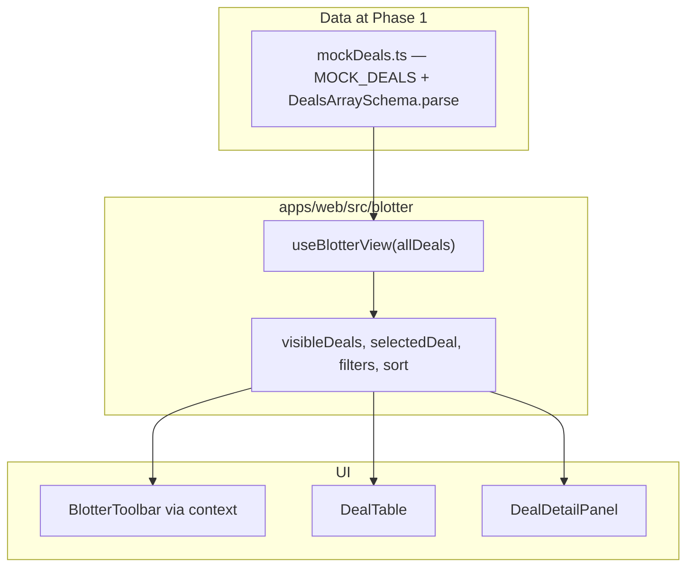

# Phase 1 — Frontend blotter (local notes)

**This folder (`docs/phases/`) is listed in `.gitignore`.** These files stay on your machine only and are not committed.

**How phase docs are structured (Phases 1–4):** **Scope** → **Walkthrough (slow)** (step-by-step + code references) → **Diagram** (where useful) → **Key files** → **Checklist** → **Later** → **Review one-liner** (single closing line).

---

## Scope (what Phase 1 was)

- React + TypeScript blotter under **`apps/web/src/blotter/`**.
- **Mock data only** for Phase 1: **`MOCK_DEALS`** passed into **`useBlotterView`** (Phase 3 later replaced the list source with **`GET /deals`**; the hook and UI patterns below are unchanged).
- Shared **`Deal`** model in **`@otcflow/shared`** (Zod + inferred types).
- Filters, sort, row selection, detail side panel, toolbar context, basic accessibility (table roles, keyboard row activation, Escape closes detail).

Run: root [README.md](../../README.md) → Local development → Web.

---

## Walkthrough (slow)

Read in order: domain shape → mock data → derived list → orchestration → row click → context.

### Where the `Deal` type comes from

The type is defined **once** in the shared package and inferred from Zod so runtime validation and TypeScript stay aligned.

```31:50:packages/shared/src/deal.ts
export const DealSchema = z.object({
  id: z.string(),
  product: ProductTypeSchema,
  counterparty: z.string(),
  notional: z.number().positive(),
  currency: CurrencySchema,
  price: z.number(),
  status: DealStatusSchema,
  trader: z.string(),
  broker: z.string(),
  /** ISO 8601 (parseable by `Date`). */
  createdAt: z.string(),
  /** ISO 8601 (parseable by `Date`). */
  updatedAt: z.string(),
  version: z.number().int().nonnegative(),
});

export type Deal = z.infer<typeof DealSchema>;

export const DealsArraySchema = z.array(DealSchema);
```

**Barrel:** **`packages/shared/src/index.ts`** re-exports **`Deal`**, **`DealSchema`**, **`DealsArraySchema`**, enums, etc. The web app resolves **`packages/shared/dist/`** after **`npm install`** / **`prepare`**.

### Where mock data lives and how it is validated

```1:4:apps/web/src/blotter/mockDeals.ts
import { DealsArraySchema } from '@otcflow/shared';

/** Curated mock rows for Phase 1 (no API). Validated at module load. */
export const MOCK_DEALS = DealsArraySchema.parse([
```

If any object violates **`DealSchema`**, the app throws **at import time**, not deep in the UI.

**Phase 1 wiring:** the screen passed **`MOCK_DEALS`** into **`useBlotterView(allDeals)`** as the full list. **Phase 3** passes **`dealsQuery.data ?? []`** instead; **`useBlotterView`** does not care where **`allDeals`** came from.

### How filtering and sorting work

All filter and sort logic lives in **`useBlotterView`**, inside one **`useMemo`** that produces **`visibleDeals`**.

```41:68:apps/web/src/blotter/useBlotterView.ts
  const visibleDeals = useMemo(() => {
    const counterpartySearchLower = counterpartyQuery.trim().toLowerCase();

    let filteredRows = allDeals.filter((deal) => {
      if (
        counterpartySearchLower &&
        !deal.counterparty.toLowerCase().includes(counterpartySearchLower)
      ) {
        return false;
      }
      if (productFilter && deal.product !== productFilter) return false;
      if (statusFilter && deal.status !== statusFilter) return false;
      return true;
    });

    filteredRows = [...filteredRows].sort((leftDeal, rightDeal) => {
      if (sortField === 'notional') {
        const notionalComparison = leftDeal.notional - rightDeal.notional;
        return sortDirection === 'asc' ? notionalComparison : -notionalComparison;
      }
      const leftUpdatedMs = Date.parse(leftDeal.updatedAt);
      const rightUpdatedMs = Date.parse(rightDeal.updatedAt);
      const updatedAtComparison = leftUpdatedMs - rightUpdatedMs;
      return sortDirection === 'asc' ? updatedAtComparison : -updatedAtComparison;
    });

    return filteredRows;
  }, [allDeals, counterpartyQuery, productFilter, statusFilter, sortField, sortDirection]);
```

**Inputs:** **`counterpartyQuery`**, **`productFilter`**, **`statusFilter`**, **`sortField`**, **`sortDirection`** (all **`useState`** in the same hook). **`setSort`** toggles direction when you click the same column again.

**Toolbar:** **`BlotterToolbar`** does not implement filter math; it reads/writes those fields through **React context** so the screen does not thread ten props through the tree.

### How selection and the detail panel work

**`selectedDeal`** is derived from **`allDeals`**, not only **`visibleDeals`**, so the selected row still resolves if filters hide it from the table.

```70:73:apps/web/src/blotter/useBlotterView.ts
  const selectedDeal = useMemo(() => {
    if (!selectedId) return null;
    return allDeals.find((deal) => deal.id === selectedId) ?? null;
  }, [allDeals, selectedId]);
```

**Flow:** **`DealTable`** calls **`onSelect(deal.id)`** → **`view.selectDeal`** ( **`setSelectedId`** ) → **`selectedDeal`** updates → **`BlotterScreen`** conditionally renders **`DealDetailPanel`**. Escape calls **`clearSelection`**.

### How `BlotterScreen` orchestrates

The screen is the **composer**: it calls **`useBlotterView(allDeals)`**, **`useMemo`**s the **toolbar context value** so the provider does not see a new object every render unless toolbar-related fields change, then mounts header → **`BlotterToolbarProvider`** + toolbar → main table → optional detail panel. It does **not** duplicate deal list state in its own **`useState`**.

### Toolbar and context

**`BlotterToolbarProvider`** wraps **`BlotterToolbar`**. **`useBlotterToolbar()`** reads the memoized bundle (queries, setters, **`productOptions`**, sort, **`resultCount`**). Context is **transport**; **`useBlotterView`** remains the **source of truth** for blotter behaviour.

### How this maps to a real trading platform (Phase 1 slice)

| Idea in this repo | Desk / platform analogue |
| ------------------ | ------------------------ |
| **`Deal` in shared** | One canonical trade/deal DTO consumed by many UIs and services. |
| **Validated mock / seed rows** | Fixture data or UAT environment snapshots for demos and tests. |
| **`visibleDeals` derivation** | Client-side blotter filters over a snapshot (server may later do paged/filtered queries). |
| **Detail side panel** | Ticket / trade drill-down without navigating away from the grid. |
| **Keyboard + `aria-selected`** | Institutional desks expect keyboardable grids and screen-reader-safe tables. |

**Not here yet:** server-backed list, real-time pushes, entitlements, booking workflows.

---

## Diagram — Phase 1 data flow (conceptual)



---

## Key files (Phase 1)

| Path | Role |
| ---- | ---- |
| `packages/shared/src/deal.ts` | **`DealSchema`**, enums, **`Deal`**, **`DealsArraySchema`**. |
| `apps/web/src/blotter/mockDeals.ts` | **`MOCK_DEALS`** (validated at load). |
| `apps/web/src/blotter/useBlotterView.ts` | Filters, sort, selection, **`visibleDeals`**, **`selectedDeal`**. |
| `apps/web/src/blotter/BlotterScreen.tsx` | Compose screen, toolbar context **`useMemo`**. |
| `apps/web/src/blotter/blotterToolbarContext.ts` | Context + **`useBlotterToolbar`**. |
| `apps/web/src/blotter/BlotterToolbarProvider.tsx` | Provider. |
| `apps/web/src/blotter/BlotterToolbar.tsx` | Filter / sort controls. |
| `apps/web/src/blotter/DealTable.tsx` | Table + row interaction. |
| `apps/web/src/blotter/DealDetailPanel.tsx` | Detail + Escape (Phase 3 adds status actions). |
| `apps/web/src/blotter/formatDealDisplay.ts` | Display formatting. |
| `apps/web/src/blotter/sortChevron.ts` | Sort direction indicator. |
| `apps/web/src/blotter/blotter.css` | Layout and status chips. |

---

## Checklist (review)

1. **Single domain model** — **`Deal`** / Zod in **`@otcflow/shared`**; web does not redefine the shape.
2. **Mock safety** — **`DealsArraySchema.parse`** at module load for **`MOCK_DEALS`**.
3. **Unidirectional data** — **`allDeals`** → hook → **`visibleDeals`** / **`selectedDeal`** → table / panel; toolbar mutates hook state via context.
4. **Derived vs stored** — **`visibleDeals`** and **`selectedDeal`** are memoized derivations, not extra **`useState`** copies of rows.
5. **Selection vs filter** — **`selectedDeal`** from **`allDeals`** by id.
6. **Separation of concerns** — table / toolbar / panel presentational; **`useBlotterView`** holds behaviour.
7. **Accessibility** — table roles, **`aria-selected`**, keyboard activation; Escape closes detail.
8. **Context stability** — **`useMemo`** on the provider value.

---

## Later (next phases)

- **Phase 2** — Express deals API and in-memory store: see **`phase-2-api-deals-walkthrough.md`**.
- **Phase 3** — TanStack Query + **`GET /deals`**, **`src/api/requestJson.ts`** + **`dealsClient.ts`**, create form, status **`PATCH`**, query invalidation: see **`phase-3-frontend-tanstack-query.md`**.
- **Phase 4** — WebSocket **`/ws/deals`**: see **`phase-4-websocket-realtime.md`**.
- **Phase 5** — MUI + AG Grid blotter: see **`phase-5-mui-ag-grid.md`**.

---

## Review one-liner

_Domain shape lives in **`@otcflow/shared`**; the blotter derives **`visibleDeals`** from **`allDeals`** and keeps toolbar wiring in context so swapping mock data for an API-fed array does not rewrite filter logic._
