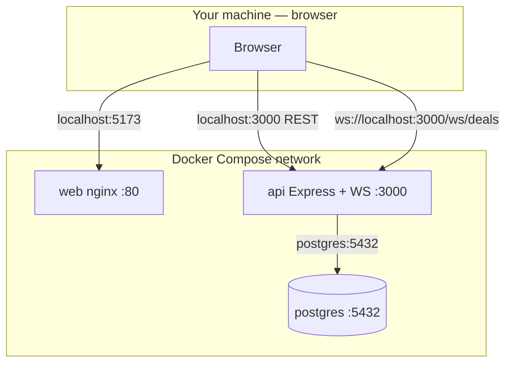

# Phase 10 — Docker Compose (local notes)

**How phase docs are structured:** **Scope** → **Walkthrough (slow)** → **Diagram** → **Key files** → **Checklist** → **Later** → **Review one-liner**.

---

## Scope (what Phase 10 was)

- **`docker-compose.yml`** at repo root — **postgres**, **api**, **web** on one Compose network.
- **`apps/api/Dockerfile`** + **`docker-entrypoint.sh`** — api image; **`prisma migrate deploy`** then start Express + WebSocket.
- **`apps/web/Dockerfile`** + **`nginx.conf`** — Vite production build served as static SPA (not Vite dev server).
- **Env:** root **`docker.env.example`** → **`.env`**; **`VITE_API_URL`**, **`VITE_WS_URL`** (web build); **`DATABASE_URL`** via Compose for api; **`CORS_ORIGIN`**.
- **Scripts:** `npm run docker:up`, `docker:seed`, `docker:migrate`, `docker:down`.
- **Docs:** root [README.md](../../README.md) Docker section; [apps/api/DATABASE.md](../../apps/api/DATABASE.md) Docker pointer.
- **Small web fixes:** dev dock single-row layout; MUI `Stack` / build fixes for production `tsc`.
- **Not added:** AWS, ECS/Fargate deploy, GraphQL, real auth/RBAC, nginx API reverse-proxy.

Run **`npm run docker:up`** then **`npm run docker:seed`** (first time). Open **`http://localhost:5173`**.

**Builds on:** [phase-9-postgres-persistence.md](phase-9-postgres-persistence.md) (Postgres + Prisma must exist before containerizing).

---

## What problem this solves

The app **already worked** with native dev (`npm run dev:web`, `npm run dev:api`, local Postgres). Phase 10 solves **operational** problems:

| Before (native only) | After (Docker option) |
| -------------------- | --------------------- |
| Install Postgres + Node on each machine | **`docker compose up`** — full stack |
| Manual migrate/seed, two terminals | Api entrypoint migrates; **`docker:seed`** once |
| Vite dev server ≠ production web | **nginx** serves **`vite build`** output |
| “Works on my machine” | Same images + Compose graph everywhere |
| Hard to demo full product quickly | One command + seed |

**Still use native dev** for daily coding (hot reload). **Use Docker** for production-like runs, onboarding, demos.

---

## Why Docker (review one-liner)

> Docker bundles **web + API + Postgres** so anyone can run the full stack with one command — automatic migrations, production-style static web, persistent volume — without installing Postgres or juggling two dev servers. Same **shape** as ECS + RDS + ALB later; different platform.

---

## Walkthrough (slow)

### 1. `docker-compose.yml` — orchestrator

Three **services**, one **network**, one **volume**:

| Service | Role |
| ------- | ---- |
| **postgres** | Official Postgres 16; **`otcflow_postgres_data`** volume; **healthcheck** |
| **api** | Built from `apps/api/Dockerfile`; env **`DATABASE_URL`** host = **`postgres`**; publishes **`API_PORT`** to host |
| **web** | Built from `apps/web/Dockerfile`; **`5173:80`** (nginx); build args **`VITE_*`** |

**Startup order:** postgres healthy → api (migrate + listen) → web (nginx).

### 2. `apps/api/Dockerfile`

- Monorepo **`npm ci`** for **@otcflow/api** + **@otcflow/shared**.
- **`prisma generate`** in image.
- **Entrypoint** = `docker-entrypoint.sh` (not raw `tsx` in Dockerfile CMD).

### 3. `docker-entrypoint.sh`

```text
prisma migrate deploy   # production-style, from prisma/migrations/
tsx src/index.ts        # Express + /ws/deals on PORT
```

Runs **every api container start** — new migrations apply on next `docker compose up`.

### 4. `apps/web/Dockerfile` — why nginx?

**`npm run build`** produces **static files** in `dist/` — no Node server.

- **Stage 1 (Node):** install web + shared, **`VITE_API_URL`** / **`VITE_WS_URL`** baked in at build, **`vite build`**.
- **Stage 2 (nginx):** copy `dist/` + **`nginx.conf`**.

**`try_files $uri $uri/ /index.html`** — standard SPA fallback (assets served by path; unknown paths → `index.html`).

The **web container does not call the api**. Only the **browser** does.

### 5. Two networks (don’t mix them up)

| Traffic | Address | Why |
| ------- | ------- | --- |
| Browser → web UI | `http://localhost:5173` | Host port → nginx :80 |
| Browser → REST / WS | `http://localhost:3000`, `ws://localhost:3000/ws/deals` | Host port → api; **browser runs on host** |
| Api → Postgres | `postgres:5432` | **Docker internal DNS** only |

**Never** set `VITE_API_URL=http://api:3000` — the browser cannot resolve Docker service names.

### 6. Environment variables

| Variable | When | Reader |
| -------- | ---- | ------ |
| `VITE_API_URL`, `VITE_WS_URL` | **Web image build** | Vite → `requestJson.ts` |
| `DATABASE_URL`, `PORT`, `CORS_ORIGIN` | **Api runtime** | Compose `environment:` |
| `POSTGRES_*` | **Postgres runtime** + interpolated into api `DATABASE_URL` | Compose |

Root **`.env`** loaded by Compose automatically (copy from **`docker.env.example`**).

**CORS:** api reads **`CORS_ORIGIN`** (default `http://localhost:5173`) — must match the URL you open in the browser.

### 7. Migrations and seed

| Action | How |
| ------ | --- |
| **Migrate** | Automatic on api start (`migrate deploy`); manual: **`npm run docker:migrate`** |
| **Seed** | Manual once: **`npm run docker:seed`** → `prisma db seed` (skips if deals exist) |

Native dev still uses **`npm run db:migrate`** (`prisma migrate dev`) and **`npm run db:seed`**.

### 8. WebSockets in Docker

Unchanged application code:

- Api: **`attachDealsWebSocket(httpServer)`** on same port as Express.
- Web: **`getDealsWebSocketUrl()`** → browser connects to **`ws://localhost:3000/ws/deals`** (from **`VITE_WS_URL`**).

Host port **3000** forwards WebSocket **upgrade** to the api container. nginx is **not** in the WS path.

### 9. Dev dock UI (minor)

**`BlotterDevDock`:** **Demo only** chip + **Acting as** on one row; simulator on the right — demo controls stay off production toolbar.

---

## Diagram — host vs Compose network



---

## Key files (Phase 10)

| Path | Role |
| ---- | ---- |
| `docker-compose.yml` | Services, ports, env, volume, depends_on |
| `docker.env.example` | Env template (who reads what) |
| `apps/api/Dockerfile` | Api image |
| `apps/api/docker-entrypoint.sh` | Migrate deploy + start |
| `apps/web/Dockerfile` | Vite build → nginx |
| `apps/web/nginx.conf` | Static SPA + fallback |
| `.dockerignore` | Lean build context; exclude `.env` |

**Three files to know cold:**

1. **`docker-compose.yml`** — whole system wiring.  
2. **`apps/web/Dockerfile`** — build-time `VITE_*`, why nginx.  
3. **`apps/api/docker-entrypoint.sh`** — migrate-then-start pattern.

---

## Production mapping (ECS/Fargate preview)

| Phase 10 (Compose) | Later (AWS) |
| ------------------ | ----------- |
| Service `api` / `web` | ECS service + task definition |
| Image build → local | ECR push from CI |
| `postgres` container + volume | **RDS** |
| `postgres` hostname in `DATABASE_URL` | RDS endpoint |
| Published `localhost` ports | **ALB** + public URL |
| `VITE_*` at web build | CI build args (still not runtime for SPA) |
| Entrypoint migrations | Migration task / init container on deploy |
| `CORS_ORIGIN` | Real frontend domain |

---

## Native dev vs Docker

| | **Native** | **Docker** |
| -- | ---------- | ---------- |
| **When** | Daily feature work | Demo, onboarding, prod-like smoke test |
| **Web** | Vite HMR | nginx + `dist/` |
| **Postgres** | Homebrew / local | Container + volume |
| **Migrations** | `db:migrate` (dev) | `migrate deploy` on api start |

---

## Checklist (review)

1. Docker Engine + Compose V2 installed.
2. `npm run docker:up` — postgres healthy, api logs `migrate deploy`, web serves.
3. `npm run docker:seed` — **`GET /deals`** returns rows.
4. Open **`http://localhost:5173`** — blotter loads; simulator + acting-as in bottom dock.
5. Create deal / status change — persists; WS updates; restart **`docker compose down` / `up`** — data remains (volume).
6. **`curl http://localhost:3000/health`** → ok.

---

## Later

- CI: build/push images; compose in pipeline for integration tests.
- ECS/Fargate + RDS + ALB (after local stack is stable).
- Optional: api healthcheck; web depends on healthy api.
- TLS / `wss://` and CloudFront for static web.

---

## Review one-liner

Phase 10 **containerizes** Postgres + API + **nginx-served** web with Compose: **migrate on api start**, **`VITE_*`** for browser URLs on **localhost**, internal **`postgres`** hostname for Prisma — **same app**, reproducible **full-stack** run, bridge to **ECS** later.

**Builds on:** [phase-9-postgres-persistence.md](phase-9-postgres-persistence.md).
