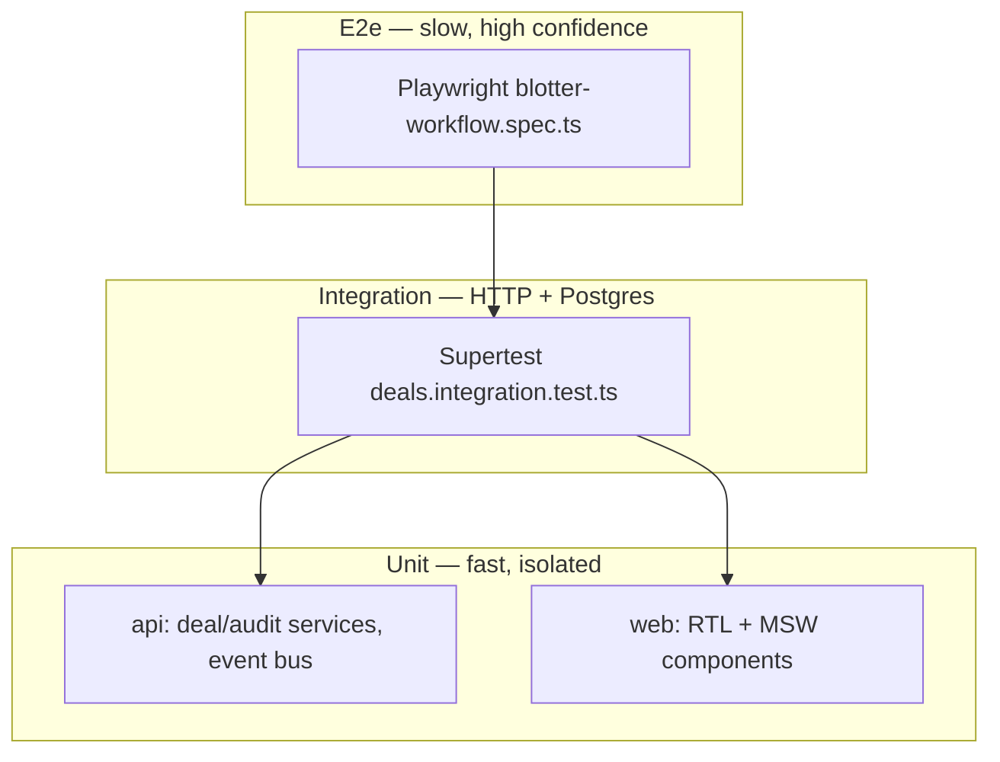

# Phase 11 — Testing pyramid (local notes)

**How phase docs are structured:** **Scope** → **Walkthrough (slow)** → **Diagram** → **Key files** → **Checklist** → **Later** → **Review one-liner**.

---

## Scope (what Phase 11 was)

- **Testing pyramid:** fast unit tests at the base, HTTP integration tests against real Postgres in the middle, one Playwright e2e path at the top.
- **`createApp()`** extracted to **`apps/api/src/app.ts`** — Express app without **`listen`** or WebSocket attach — shared by **`index.ts`** and Supertest integration tests.
- **API unit (Vitest):** mocked repositories + **`prisma.$transaction`** — **`deal.service`**, **`audit.service`**, **`InMemoryDealEventBus`**, **`wireDealEventBusToWebSocket`**.
- **API integration (Vitest + Supertest):** real Prisma + Postgres; **`beforeEach`** wipes deals and audit; **`deals.integration.test.ts`** covers REST create/status/audit/404 paths.
- **Web unit (Vitest + RTL + jsdom):** blotter components with **MSW** intercepting **`GET /deals/:id/events`** and **`POST /deals`** — no live API required.
- **E2e (Playwright):** **`e2e/blotter-workflow.spec.ts`** — acting-as user, create deal, status change, audit timeline visible.
- **Root scripts:** **`npm run test`**, **`test:unit`**, **`test:integration`**, **`test:e2e`**, **`test:e2e:install`**.
- **Integration DB:** **`setIntegrationDatabaseUrl.ts`** loads repo **`.env`** and defaults Postgres to **`127.0.0.1:5433`** (Docker Compose publish port).
- **Not added:** full coverage of every screen, GraphQL tests (Phase 13), CI pipeline wiring, load tests.

Run **`npm run test`** (unit + integration) with Postgres up. Run **`npm run test:e2e`** with api + web dev servers (Playwright can start them automatically).

**Builds on:** [phase-9-postgres-persistence.md](phase-9-postgres-persistence.md) (integration tests need a database), [phase-10-docker-compose.md](phase-10-docker-compose.md) (Compose Postgres on **5433**).

---

## What problem this solves

| Before (Phase 10) | After (Phase 11) |
| ----------------- | ---------------- |
| Manual smoke testing only | Automated regression at three levels |
| **`index.ts`** monolith — hard to Supertest | **`createApp()`** — test HTTP without starting WS |
| Web components untested | RTL + MSW for forms, audit panel, grid renderers |
| No full-stack confidence | Playwright exercises real api + web + Postgres path |

**Principle:** unit tests prove **service logic** in isolation; integration tests prove **HTTP + DB** contracts; e2e proves **one critical desk workflow** end-to-end.

---

## Walkthrough (slow)

### 1. `createApp()` — testable HTTP surface

**`apps/api/src/app.ts`** wires middleware, REST routers, GraphQL HTTP mount (Phase 13), and error handler. It does **not** call **`listen`**, attach **`/ws/deals`**, or wire the event bus.

**`apps/api/src/index.ts`** remains the production entry: **`createServer(createApp())`**, WebSocket + GraphQL subscription attach, event-bus bridges, **`listen`**.

Integration tests import **`createApp()`** only — faster, no port conflicts, no duplicate WS servers.

### 2. API unit tests — mock the edges

**Config:** **`vitest.unit.config.ts`** — Node environment, **`src/**/*.test.ts`**, excludes **`*.integration.test.ts`**.

**Setup:** **`src/test/unit.setup.ts`** mocks **`dealEventBus`** and **`broadcastDealEventToClients`** so service tests never open sockets.

**Pattern (deal service):**

```text
vi.mock repositories + audit.service + prisma.$transaction
→ call createDeal / updateDealStatus
→ assert repo + audit called inside transaction
→ assert dealEventBus.publish after commit
```

**Fixtures:** **`src/test/fixtures.ts`** — **`makeDeal`**, **`validCreateDealBody`**, demo users aligned with seed data.

Flat **`test('…')`** style throughout (no nested **`describe`** required).

### 3. API integration tests — real Postgres

**Config:** **`vitest.integration.config.ts`** — includes **`*.integration.test.ts`**, **`fileParallelism: false`** (shared DB; avoids cross-file wipe races).

**Setup chain:**

1. **`setIntegrationDatabaseUrl.ts`** — sets **`DATABASE_URL`** before Prisma loads (port **5433** when using Docker Postgres).
2. **`integration.setup.ts`** — **`beforeAll`**: connect Prisma, **`initUserCache`**, **`createApp()`**; **`beforeEach`**: delete all deals + audit; **`afterAll`**: disconnect.

**`deals.integration.test.ts`** exercises:

| Case | Asserts |
| ---- | ------- |
| Empty blotter | **`GET /deals`** → **`[]`** |
| Create + list | persisted row, newest first |
| Create + audit | **`DEAL_CREATED`**, acting **`x-user-id`** on audit row |
| Validation | **400** for bad body |
| Status patch | version bump, **`DEAL_STATUS_CHANGED`** audit |
| 404 paths | missing deal id |

Uses **Supertest** against **`integrationApp`** — same middleware and routes as production.

### 4. Web unit tests — RTL + MSW

**Config:** **`apps/web/vitest.config.ts`** — **jsdom**, **`src/test/setup.ts`** starts MSW with **`onUnhandledRequest: 'error'`** (forces explicit handlers per test).

**MSW layout:** **`src/test/msw/`** — **`server.ts`**, **`handlers.ts`**, **`dealHandlers.ts`**, **`constants.ts`** (**`API_BASE_URL`**).

**Examples:**

| Test file | What it proves |
| --------- | -------------- |
| **`CreateDealForm.test.tsx`** | form submit → **`POST /deals`** with expected body |
| **`DealAuditHistory.test.tsx`** | timeline renders mocked audit rows |
| **`DealBlotterGrid.test.tsx`** | AG Grid receives row data |
| **`AppBarUserSelect.test.tsx`** | acting-as control |

MSW keeps web tests **fast and deterministic** — no api process, no Postgres.

### 5. E2e — Playwright full stack

**`playwright.config.ts`:**

- **`testDir: ./e2e`**, **`workers: 1`**, **`fullyParallel: false`**
- **`webServer`**: starts **`dev:api`** (health check) + **`dev:web`** unless **`PLAYWRIGHT_SKIP_WEBSERVER`**
- **`baseURL`**: **`http://localhost:5173`** (or **`PLAYWRIGHT_BASE_URL`**)

**`e2e/blotter-workflow.spec.ts`:**

```text
open blotter → select acting user (Broker)
→ New trade → fill counterparty/trader/broker → Create
→ click row in AG Grid → detail panel
→ click PENDING status chip
→ assert audit history shows create + status change with user name
```

Unique counterparty per run (**`Date.now()`**) avoids collisions with seeded data.

### 6. Root npm scripts

| Script | Runs |
| ------ | ---- |
| **`npm run test`** | api unit + api integration + web unit |
| **`npm run test:unit`** | api unit + web unit |
| **`npm run test:integration`** | api integration only |
| **`npm run test:e2e`** | Playwright (install Chromium first: **`test:e2e:install`**) |

Workspace flags: **`-w @otcflow/api`**, **`-w @otcflow/web`**.

---

## Diagram — testing pyramid



---

## Key files (Phase 11)

| Path | Role |
| ---- | ---- |
| `apps/api/src/app.ts` | **`createApp()`** for tests + production |
| `apps/api/vitest.unit.config.ts` | API unit Vitest config |
| `apps/api/vitest.integration.config.ts` | Integration config + **`fileParallelism: false`** |
| `apps/api/src/test/setIntegrationDatabaseUrl.ts` | **`DATABASE_URL`** for test Postgres |
| `apps/api/src/test/integration.setup.ts` | Shared app, DB wipe per test |
| `apps/api/src/test/fixtures.ts` | Shared test deals and users |
| `apps/api/src/routes/deals.integration.test.ts` | REST integration suite |
| `apps/web/vitest.config.ts` | Web unit Vitest + jsdom |
| `apps/web/src/test/msw/` | MSW server and deal handlers |
| `e2e/blotter-workflow.spec.ts` | Full-stack workflow test |
| `playwright.config.ts` | E2e runner + dev server orchestration |
| `package.json` (root) | **`test`**, **`test:unit`**, **`test:integration`**, **`test:e2e`** |

**Three files to know cold:**

1. **`app.ts`** — why Supertest does not need **`listen`**.  
2. **`integration.setup.ts`** — real DB lifecycle for HTTP tests.  
3. **`apps/web/src/test/setup.ts`** — MSW strict mode for component tests.

---

## Running tests locally

| Layer | Prerequisites | Command |
| ----- | ------------- | ------- |
| API unit | none | **`npm run test:unit -w @otcflow/api`** |
| API integration | Postgres on **5433** (Docker or local) | **`npm run test:integration -w @otcflow/api`** |
| Web unit | none | **`npm run test:unit -w @otcflow/web`** |
| E2e | api + web (Playwright can start them) | **`npm run test:e2e`** |

Copy **`docker.env.example`** → **`.env`** at repo root so integration tests pick up **`POSTGRES_HOST_PORT`**.

---

## Checklist (review)

1. **`npm run test`** — all unit + integration green with Postgres up.
2. **`createApp()`** used in integration tests; **`index.ts`** still starts WS + bus wiring.
3. Integration **`beforeEach`** clears deals — tests do not depend on seed data.
4. Web MSW tests fail on unhandled HTTP — handlers are explicit per test.
5. **`npm run test:e2e`** — create → status → audit path passes.
6. Unit tests mock **`dealEventBus.publish`** — no side effects on real bus.

---

## Later

- CI job matrix: unit (no DB), integration (service container Postgres), e2e (artifact on failure).
- GraphQL integration tests (Phase 13).
- WebSocket integration test (connect **`/ws/deals`**, assert message after **`POST /deals`**).
- Coverage thresholds once the suite stabilises.
- Contract tests between **`@otcflow/shared`** Zod schemas and OpenAPI/GraphQL SDL.

---

## Review one-liner

Phase 11 adds a **testing pyramid**: Vitest unit tests with mocks, Supertest integration against **real Postgres** via **`createApp()`**, RTL + **MSW** for the web blotter, and one **Playwright** e2e for create → status → audit — **`npm run test`** at the root ties the layers together.

**Builds on:** [phase-9-postgres-persistence.md](phase-9-postgres-persistence.md), [phase-10-docker-compose.md](phase-10-docker-compose.md). **Next:** [phase-12-event-bus-pubsub.md](phase-12-event-bus-pubsub.md) — decouple WebSocket fan-out from the write path via an internal event bus.
