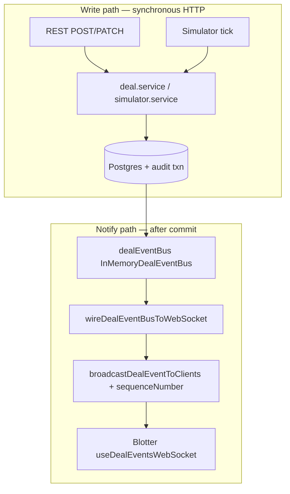

# Phase 12 — Internal event bus and pub/sub (local notes)

**How phase docs are structured:** **Scope** → **Walkthrough (slow)** → **Diagram** → **Key files** → **Checklist** → **Later** → **Review one-liner**.

---

## Scope (what Phase 12 was)

- **Domain events:** **`DomainDealEvent`** in **`@otcflow/shared`** — same **`type`** vocabulary as wire **`DealEvent`**, but **no `sequenceNumber`** (stream metadata stays in the transport layer).
- **Event bus port:** **`DealEventBus`** interface — **`publish`** + **`subscribe`** with unsubscribe.
- **In-process implementation:** **`InMemoryDealEventBus`** — synchronous fan-out to local handlers; swappable for a broker later.
- **Singleton:** **`dealEventBus`** — one bus per API process.
- **Producers:** **`deal.service`** and **`simulator.service`** call **`dealEventBus.publish()`** **after** the Prisma transaction commits (audit still inside the txn).
- **Consumer (WebSocket):** **`wireDealEventBusToWebSocket`** — subscribes to the bus → **`broadcastDealEventToClients`** (adds monotonic **`sequenceNumber`**, same **`DealEventSchema`** as Phase 4).
- **Wiring:** **`index.ts`** — **`wireDealEventBusToWebSocket(dealEventBus)`** alongside **`attachDealsWebSocket`**.
- **Unchanged for clients:** **`/ws/deals`** wire format, blotter **`useDealEventsWebSocket`**, REST routes, audit semantics, Postgres persistence.
- **Tests:** **`inMemoryDealEventBus.test.ts`**, **`wireDealEventBusToWebSocket.test.ts`**; deal service unit test asserts **`publish`** after write.
- **Not added:** Redis/Kafka/SNS, multi-instance fan-out, outbox pattern, guaranteed delivery. GraphQL subscriptions added in Phase 13 on the same bus.

Run **`npm run dev:api`** + **`npm run dev:web`**: create or patch a deal — WebSocket clients still receive **`DealEvent`** JSON with **`sequenceNumber`**.

**Builds on:** [phase-4-websocket-realtime.md](phase-4-websocket-realtime.md) (WebSocket transport), [phase-9-postgres-persistence.md](phase-9-postgres-persistence.md) (transactional writes + audit).

---

## What problem this solves

| Before (Phase 4–9) | After (Phase 12) |
| ------------------ | ---------------- |
| **`deal.service`** called **`broadcastDealEvent`** directly | Service publishes **domain fact** to bus; WS is one subscriber |
| Simulator duplicated WS call pattern | Simulator also **`publish`** — same pipeline |
| Hard to add second consumer (GraphQL, analytics) | **`subscribe`** another bridge without touching services |
| Transport mixed with domain | **`DomainDealEvent`** vs **`DealEvent`** (+ sequence) separation |

**Key idea:** the write path emits **“deal X changed”** once; **how** that reaches browsers (or GraphQL, or a queue) is a separate concern.

---

## Walkthrough (slow)

### 1. Two event shapes — domain vs wire

**Domain (internal bus):** **`packages/shared/src/domainDealEvents.ts`**

- Discriminated union: **`DEAL_CREATED`**, **`DEAL_STATUS_CHANGED`**, **`DEAL_PRICE_CHANGED`**, **`DEAL_AMENDED`**
- Payload: **`{ type, deal }`** — full **`Deal`** snapshot, validated by **`DomainDealEventSchema`**

**Wire (WebSocket clients):** **`packages/shared/src/dealEvents.ts`** (Phase 4)

- Same **`type`** + **`deal`**, plus **`sequenceNumber`** assigned at broadcast time in **`dealsWs.ts`**

Separation lets a future broker store domain events without stream counters; each transport adds its own metadata.

### 2. `DealEventBus` port

**`apps/api/src/events/eventBus.types.ts`:**

```typescript
export interface DealEventBus {
  publish(event: DomainDealEvent): void;
  subscribe(handler: DomainDealEventHandler): () => void;
}
```

Comments document broker swap options (Kafka, SNS+SQS, EventBridge, etc.) without implementing them.

### 3. `InMemoryDealEventBus`

**`apps/api/src/events/inMemoryDealEventBus.ts`:**

- **`Set<DomainDealEventHandler>`** — **`publish`** validates with Zod, then invokes each handler synchronously
- **`subscribe`** returns unsubscribe function
- Test helpers: **`clearSubscribers`**, **`subscriberCount`**

**Production swap:** replace this class with an adapter that serializes to a topic; consumer workers call the same handler shape.

### 4. Producers — after commit only

**`deal.service.ts`** (unchanged txn semantics from Phase 9):

```text
prisma.$transaction:
  insert/update Deal
  insert AuditEvent
→ dealEventBus.publish({ type, deal: persisted })
→ return persisted (REST / GraphQL response)
```

**`simulator.service.ts`** — same **`publish`** after each simulated tick transaction.

**Audit is not on the bus** — audit rows are written in the database inside the transaction. The bus carries **notify** events for realtime consumers only.

### 5. WebSocket bridge — transport subscriber

**`wireDealEventBusToWebSocket.ts`:**

```text
bus.subscribe((event) => broadcastDealEventToClients(event))
```

**`dealsWs.ts`** — unchanged client-facing behaviour:

- Maintains **`clients`** set and **`nextSequenceNumber`**
- **`broadcastDealEventToClients`** — parses **`DealEventSchema`**, assigns **`sequenceNumber`**, **`send`** to open sockets

Phase 4 blotter code does not change — it still parses **`DealEvent`** with sequence numbers.

### 6. Startup wiring

**`index.ts`:**

```text
attachDealsWebSocket(httpServer)     // transport
wireDealEventBusToWebSocket(dealEventBus)  // bridge
```

Order: attach WS server first so clients can connect; bridge registers on bus at startup. Any **`publish`** after boot reaches connected clients.

### 7. Unit test strategy

- **`deal.service.test.ts`** — mock **`dealEventBus.publish`**, assert called with correct **`type`** + **`deal`** after mocked txn
- **`wireDealEventBusToWebSocket.test.ts`** — in-memory bus + mocked **`broadcastDealEventToClients`**
- **`inMemoryDealEventBus.test.ts`** — subscribe/unsubscribe, multiple handlers, validation

---

## Diagram — write path vs notify path



**Phase 13** adds a second subscriber: **`wireDealEventBusToGraphQL`** → **`graphQLPubSub`** → **`dealUpdated`** subscription — same bus, different transport.

---

## Key files (Phase 12)

| Path | Role |
| ---- | ---- |
| `packages/shared/src/domainDealEvents.ts` | **`DomainDealEvent`** Zod + types |
| `apps/api/src/events/eventBus.types.ts` | **`DealEventBus`** port |
| `apps/api/src/events/inMemoryDealEventBus.ts` | In-process implementation |
| `apps/api/src/events/dealEventBus.ts` | Process singleton |
| `apps/api/src/events/wireDealEventBusToWebSocket.ts` | Bus → WebSocket bridge |
| `apps/api/src/ws/dealsWs.ts` | **`sequenceNumber`**, client fan-out |
| `apps/api/src/services/deal.service.ts` | **`publish`** after txn |
| `apps/api/src/services/simulator.service.ts` | **`publish`** after simulated writes |
| `apps/api/src/index.ts` | Attach WS + wire bridge |

**Three files to know cold:**

1. **`deal.service.ts`** — txn first, **`publish`** second.  
2. **`wireDealEventBusToWebSocket.ts`** — thin bridge pattern for any transport.  
3. **`domainDealEvents.ts`** vs **`dealEvents.ts`** — domain fact vs wire envelope.

---

## Comparison to Phase 4

| Aspect | Phase 4 | Phase 12 |
| ------ | ------- | -------- |
| Blotter WS URL | **`/ws/deals`** | unchanged |
| Client JSON | **`DealEvent`** + **`sequenceNumber`** | unchanged |
| Service after write | direct **`broadcastDealEvent`** | **`dealEventBus.publish`** |
| Adding GraphQL subs | would duplicate service calls | add another **`subscribe`** |
| Multi-instance API | each process own **`clients`** set | bus adapter → shared broker |

---

## Production mapping (preview)

| Phase 12 (in-process) | Later (managed) |
| --------------------- | --------------- |
| **`InMemoryDealEventBus`** | SNS topic **`deals.events`** or Kafka topic |
| **`publish` after commit** | Outbox table + relay worker (at-least-once) |
| **`wireDealEventBusToWebSocket`** | ECS/Lambda consumer → API Gateway WebSocket or custom fan-out service |
| Single Node **`clients`** set | Sticky sessions or shared pub/sub for WS instances |
| Synchronous handlers | Async consumers with idempotent **`deal.version`** merge on client |

---

## Checklist (review)

1. Create deal via REST — WS clients receive **`DEAL_CREATED`** with incrementing **`sequenceNumber`**.
2. Status patch — **`DEAL_STATUS_CHANGED`** on **`/ws/deals`**; audit row in Postgres unchanged from Phase 7/9.
3. Simulator tick — events flow through bus (not direct **`broadcast`** from service).
4. **`deal.service`** unit test — **`dealEventBus.publish`** mocked and asserted.
5. **`wireDealEventBusToWebSocket`** unit test — handler forwards to **`broadcastDealEventToClients`**.
6. No **`broadcastDealEventToClients`** import in **`deal.service`** — only **`dealEventBus`**.

---

## Later

- Outbox pattern for reliable publish-after-commit across process restarts.
- Broker-backed **`DealEventBus`** adapter + integration test with testcontainers.
- **`DEAL_PRICE_CHANGED`** / **`DEAL_AMENDED`** producers when amend APIs exist.
- Metrics on publish rate, subscriber lag, WS connected count.
- Phase 13 GraphQL subscription bridge on the same bus.

---

## Review one-liner

Phase 12 introduces an internal **`DealEventBus`**: services **`publish` `DomainDealEvent`** after Postgres commits; **`wireDealEventBusToWebSocket`** is the first subscriber and still delivers Phase 4 **`DealEvent`** JSON on **`/ws/deals`** — decoupling domain facts from transport so GraphQL and broker-backed deployments can subscribe without changing the write path.

**Builds on:** [phase-4-websocket-realtime.md](phase-4-websocket-realtime.md), [phase-9-postgres-persistence.md](phase-9-postgres-persistence.md). **Next:** [phase-13-graphql.md](phase-13-graphql.md).
