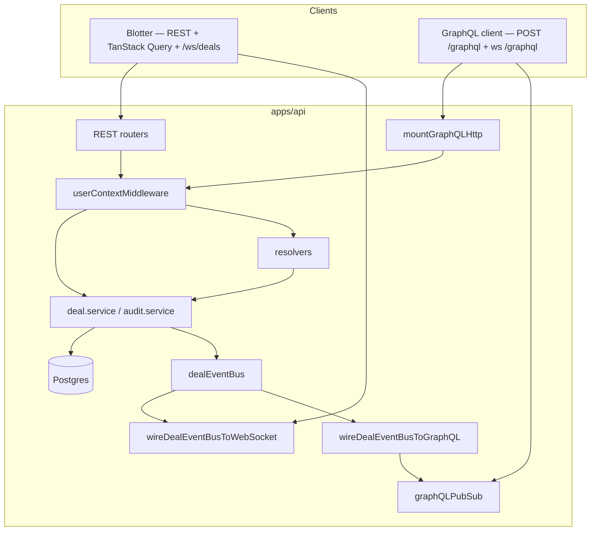

# Phase 13 — GraphQL API and subscriptions (local notes)

**How phase docs are structured:** **Scope** → **Walkthrough (slow)** → **Diagram** → **Key files** → **Checklist** → **Later** → **Review one-liner**.

---

## Scope (what Phase 13 was)

- **Additive GraphQL layer** on **`apps/api`** — REST and **`/ws/deals`** unchanged; blotter still uses TanStack Query + REST + Phase 4 WebSocket.
- **HTTP GraphQL:** **`POST /graphql`** (and GET) via **`graphql-http`** — queries and mutations only (subscriptions rejected over HTTP by design).
- **Subscription transport:** **`graphql-ws`** on **`ws://host/graphql`** — separate path from blotter **`/ws/deals`**.
- **Schema types:** **`Deal`**, **`AuditEvent`**, **`User`**, enums aligned with **`@otcflow/shared`**.
- **Queries:** **`deals`**, **`deal(id)`**, **`dealEvents(dealId)`**.
- **Mutations:** **`createDeal(input)`**, **`updateDealStatus(id, status)`**.
- **Subscription:** **`dealUpdated`** — payload is **`DealDomainEvent`** (same shape as Phase 12 bus events).
- **Resolvers:** thin delegation to **`deal.service`** and **`audit.service`** — same validation (**`CreateDealBodySchema`**) and **`ctx.currentUser`** as REST controllers.
- **Realtime:** **`wireDealEventBusToGraphQL`** — Phase 12 **`dealEventBus`** → in-memory **`graphQLPubSub`** → subscription iterators.
- **Tests:** **`graphql.integration.test.ts`** (5 HTTP cases), **`wireDealEventBusToGraphQL.test.ts`** (bus → pubsub unit test).
- **Not added:** GraphQL client in **`apps/web`**, AppSync, auth/RBAC, AWS, replacing REST, federation.

Run **`npm run dev:api`**: **`http://localhost:3000/graphql`** for queries/mutations; **`ws://localhost:3000/graphql`** for **`dealUpdated`**.

**Builds on:** [phase-6-user-context.md](phase-6-user-context.md) (**`x-user-id`** / **`currentUser`**), [phase-7-audit-trail.md](phase-7-audit-trail.md), [phase-12-event-bus-pubsub.md](phase-12-event-bus-pubsub.md) (subscription source).

---

## What problem this solves

| Before (Phase 12) | After (Phase 13) |
| ----------------- | ---------------- |
| REST + raw **`/ws/deals`** only | Typed schema; one endpoint for reads/writes |
| New clients must learn REST paths | GraphQL introspection + field selection |
| Second realtime protocol = duplicate service calls | Subscriptions subscribe to **same bus** as WS |
| No batch “deal + audit” in one round trip | Client can query both in one document (when using GQL client) |

**Boundary:** the **web blotter does not use GraphQL yet** — it still uses **`dealsClient.ts`** (REST) + **`useDealEventsWebSocket`**. GraphQL is an alternative API surface for tools, mobile, or a future client migration.

---

## Walkthrough (slow)

### 1. Where the GraphQL server is configured

GraphQL is split across **HTTP** (in **`createApp()`**) and **WebSocket subscriptions** (in **`index.ts`** only — keeps Vitest integration tests from loading **`graphql-ws`**).

**HTTP — `mountGraphQLHttp.ts`:**

```typescript
app.all('/graphql', createHandler({ schema, context }));
```

Mounted in **`app.ts`** after REST routers, before error middleware. Uses **`graphql-http`** Express adapter.

**Context gotcha:** the handler passes a **`graphql-http` Request** wrapper; Express **`req`** is at **`req.raw`**. Context reads **`req.raw.currentUser`** (set by **`userContextMiddleware`** before the handler runs).

**Subscriptions — `attachGraphQLSubscriptions.ts`:**

```typescript
new WebSocketServer({ server: httpServer, path: '/graphql' });
useServer({ schema, context }, wsServer);
```

Called from **`index.ts`** alongside **`attachDealsWebSocket`**. Subscription context resolves **`x-user-id`** from WS **`connectionParams`** or upgrade headers via **`resolveGraphQLUser`**.

**Event bridge — `index.ts`:**

```text
wireDealEventBusToWebSocket(dealEventBus)   // blotter /ws/deals
wireDealEventBusToGraphQL(dealEventBus)     // GraphQL dealUpdated
```

### 2. How the schema is defined

**SDL:** **`typeDefs.ts`** — GraphQL schema as a template string (enums, **`Deal`**, **`AuditEvent`**, **`User`**, **`CreateDealInput`**, Query/Mutation/Subscription root types).

**Executable schema:** **`schema.ts`:**

```typescript
makeExecutableSchema({ typeDefs, resolvers });
```

No code-first decorators — plain SDL + resolver map, easy to read in review.

**Naming alignment:**

| GraphQL | Shared / REST |
| ------- | ------------- |
| **`DealStatus`**, **`ProductType`**, etc. | Same enum literals as Zod |
| **`AuditEvent.user`** | Nested **`User`** object (REST returns same JSON shape) |
| **`DealDomainEvent`** | Maps to **`DomainDealEvent`** on the bus (no **`sequenceNumber`**) |

### 3. Queries — what each does

| Query | Resolver | Service | REST equivalent |
| ----- | -------- | ------- | ----------------- |
| **`deals`** | **`Query.deals`** | **`dealService.listDeals()`** | **`GET /deals`** |
| **`deal(id)`** | **`Query.deal`** | **`dealService.getDealById(id)`** | **`GET /deals/:id`** — 404 → GraphQL error **`Deal not found`** |
| **`dealEvents(dealId)`** | **`Query.dealEvents`** | **`auditService.listDealAuditEvents(dealId)`** | **`GET /deals/:id/events`** |

Queries do **not** require **`x-user-id`** for reads (same as REST list/get today). Mutations are where attribution matters.

### 4. Mutations — what each does

| Mutation | Resolver | Service | REST equivalent |
| -------- | -------- | ------- | ----------------- |
| **`createDeal(input)`** | Validates with **`CreateDealBodySchema`**, passes **`ctx.currentUser`** | **`dealService.createDeal(body, user)`** | **`POST /deals`** |
| **`updateDealStatus(id, status)`** | Passes **`ctx.currentUser`** | **`dealService.updateDealStatus(id, status, user)`** | **`PATCH /deals/:id/status`** |

Both return the persisted **`Deal`** (including **`version`**, timestamps). Validation errors become GraphQL errors with code **`BAD_USER_INPUT`**.

### 5. Resolvers reuse existing services

**`resolvers.ts`** is intentionally thin — parallel to **`deal.controller.ts`**:

```text
REST controller                    GraphQL resolver
─────────────────────────────────────────────────────
CreateDealBodySchema.parse(body)   CreateDealBodySchema.parse(args.input)
dealService.createDeal(…, user)    dealService.createDeal(…, ctx.currentUser)
next(err) / HttpError JSON         toGraphQLError(err) → GraphQLError
```

No duplicate Prisma or repository calls in the GraphQL layer. If business rules change in **`deal.service`**, REST and GraphQL both pick them up.

### 6. Current user context in mutations

**HTTP path:**

1. **`userContextMiddleware`** runs for every Express request → **`req.currentUser`**.
2. **`mountGraphQLHttp`** context: **`{ currentUser: req.raw.currentUser }`**.
3. Mutation resolvers receive **`ctx.currentUser`**.

**WebSocket subscription path:**

1. Client sends **`connectionParams: { "x-user-id": "<id>" }`** (or header on upgrade).
2. **`resolveGraphQLUser`** → known user from cache or default user.

Same demo header as Phase 6 REST — **not** cryptographic trust; production would swap for JWT/session without changing resolver signatures.

### 7. Audit events still created

GraphQL mutations never call **`audit.service`** directly. They call **`deal.service`**, which unchanged from Phase 9/12:

```text
prisma.$transaction:
  insert/update Deal
  auditService.recordDealCreated / recordDealStatusChanged
→ dealEventBus.publish (after commit)
```

Integration test **`createDeal mutation persists deal and audit for acting user`** proves: mutation → **`dealEvents`** query shows **`DEAL_CREATED`** with correct **`user.id`**.

### 8. Subscriptions and the event bus

```text
deal.service (after txn)
    → dealEventBus.publish(DomainDealEvent)
           ├→ wireDealEventBusToWebSocket → /ws/deals (DealEvent + sequenceNumber)
           └→ wireDealEventBusToGraphQL → graphQLPubSub.publish('DEAL_UPDATED', { dealUpdated })
                    → Subscription.dealUpdated asyncIterator
```

**`graphQLPubSub`** (`graphql-subscriptions` **`PubSub`**) is **GraphQL-specific fan-out** — not a second domain bus. The **domain bus** remains the single publish point after writes.

**`Subscription.dealUpdated`** resolver only returns **`graphQLPubSub.asyncIterator([GRAPHQL_DEAL_UPDATED_TOPIC])`** — no service call at subscribe time; events arrive when the bus fires.

### 9. GraphQL vs REST in this app

| Aspect | REST (blotter today) | GraphQL (additive) |
| ------ | -------------------- | ------------------ |
| Entry | Multiple paths | **`/graphql`** |
| Reads | **`GET /deals`**, **`GET /deals/:id/events`** | Single POST with query document |
| Writes | **`POST /deals`**, **`PATCH …/status`** | Mutations in same endpoint |
| Realtime | **`/ws/deals`** + **`DealEvent`** + **`sequenceNumber`** | **`ws://…/graphql`** + **`dealUpdated`** |
| Client | **`dealsClient.ts`** + TanStack Query | Not wired in web yet |
| Errors | HTTP status + JSON **`{ error }`** | **`errors[]`** in GraphQL response |
| Validation | Zod in controller | Same Zod in resolver |

Both share **`createApp()`** middleware, services, Postgres, audit, and **`dealEventBus`**.

### 10. GraphQL vs TanStack Query

They operate at **different layers**:

| | **TanStack Query** | **GraphQL** |
| -- | ------------------ | ----------- |
| **Where** | **`apps/web`** (browser) | **`apps/api`** (server) |
| **Role** | Client cache, refetch, optimistic updates | API schema, resolvers, subscriptions |
| **Today** | Caches **`GET /deals`**; WS patches cache | Alternative to REST **if** a client adopted it |
| **Realtime** | **`useDealEventsWebSocket`** merges into Query cache | **`dealUpdated`** subscription (separate WS protocol) |

**Not either/or:** TanStack Query is a **client data library**; GraphQL is a **server API style**. A future GraphQL client could use **`@tanstack/react-query`** with a GraphQL fetcher, or **Apollo Client** with its own cache — the blotter has not migrated.

**Current split:**

```text
Blotter (Phase 3–4):
  TanStack Query ← REST GET /deals
  TanStack Query ← WS /ws/deals (patch cache)

Hypothetical GraphQL client:
  TanStack Query or Apollo ← POST /graphql (queries/mutations)
  graphql-ws client ← ws://host/graphql (dealUpdated)
```

### 11. What tests prove

**Integration — `graphql.integration.test.ts`:**

| Test | Proves |
| ---- | ------ |
| **`deals` query** | List reads Postgres |
| **`deal(id)` query** | Single deal by id |
| **`createDeal` mutation** | Persist + audit with **`x-user-id`** |
| **`updateDealStatus` mutation** | Version increment |
| **`deal` unknown id** | **`NOT_FOUND`**-style error message |

**Unit — `wireDealEventBusToGraphQL.test.ts`:**

- Bus **`publish`** → **`graphQLPubSub.publish`** with **`{ dealUpdated: event }`**.

No subscription WebSocket e2e yet — bridge unit test + HTTP integration cover the critical paths.

---

## Diagram



---

## Key files (Phase 13)

| Path | Role |
| ---- | ---- |
| `apps/api/src/graphql/typeDefs.ts` | GraphQL SDL |
| `apps/api/src/graphql/resolvers.ts` | Query/Mutation/Subscription → services |
| `apps/api/src/graphql/schema.ts` | **`makeExecutableSchema`** |
| `apps/api/src/graphql/context.ts` | **`GraphQLContext`**, **`resolveGraphQLUser`** |
| `apps/api/src/graphql/mountGraphQLHttp.ts` | **`POST /graphql`** handler |
| `apps/api/src/graphql/attachGraphQLSubscriptions.ts` | **`graphql-ws`** on **`/graphql`** |
| `apps/api/src/graphql/graphQLPubSub.ts` | In-memory subscription pub/sub |
| `apps/api/src/graphql/wireDealEventBusToGraphQL.ts` | Bus → pubsub bridge |
| `apps/api/src/graphql/toGraphQLError.ts` | **`HttpError`** / **`ZodError`** mapping |
| `apps/api/src/app.ts` | **`mountGraphQLHttp(app)`** |
| `apps/api/src/index.ts` | WS subscriptions + bus wiring |
| `apps/api/src/graphql/graphql.integration.test.ts` | HTTP query/mutation tests |

**Three files to know cold:**

1. **`resolvers.ts`** — proves GraphQL is a thin facade over existing services.  
2. **`wireDealEventBusToGraphQL.ts`** — subscriptions without duplicating write logic.  
3. **`mountGraphQLHttp.ts`** — HTTP entry + **`req.raw.currentUser`** context wiring.

---

## Example operations

**List deals:**

```graphql
query { deals { id counterparty status version } }
```

**Create (header `x-user-id: <user-id>`):**

```graphql
mutation($input: CreateDealInput!) {
  createDeal(input: $input) { id version status }
}
```

**Subscribe (`graphql-ws`):**

```graphql
subscription { dealUpdated { type deal { id status version } } }
```

---

## Managed GraphQL mapping (preview)

| Phase 13 (in-process) | Later |
| --------------------- | ----- |
| **`graphql-http`** on Express | AppSync or ALB → ECS |
| **`graphQLPubSub`** | AppSync subscriptions or Redis pub/sub |
| **`wireDealEventBusToGraphQL`** | Lambda/consumer: bus topic → AppSync **`publish`** |
| **`graphql-ws`** on **`/graphql`** | AppSync real-time API |
| Demo **`x-user-id`** | Cognito JWT → **`context.currentUser`** |

---

## Checklist (review)

1. **`POST /graphql`** — **`deals`** query returns rows from Postgres.
2. **`createDeal`** with **`x-user-id`** — audit row attributed correctly.
3. REST **`POST /deals`** still works — GraphQL did not replace routes.
4. Blotter still updates via **`/ws/deals`** — WS bridge unchanged.
5. Simulator tick → bus → both WS and GraphQL pubsub (manual or unit test on bridge).
6. Integration tests green with Postgres on **5433**.

---

## Later

- GraphQL client in **`apps/web`** (optional migration from **`dealsClient`**).
- Subscription integration test with **`graphql-ws`** client.
- DataLoader for N+1 if nested fields grow.
- Apollo Router / federation if services split.
- Persisted queries / allow-list for production hardening.

---

## Review one-liner

Phase 13 adds an **additive GraphQL layer**: SDL + thin resolvers over **unchanged services**, **`x-user-id`** context for mutations, HTTP at **`/graphql`**, subscriptions at **`ws://…/graphql`** fed by the **same `dealEventBus`** as **`/ws/deals`** — REST and TanStack Query blotter untouched.

**Builds on:** [phase-12-event-bus-pubsub.md](phase-12-event-bus-pubsub.md). **Next:** [phase-14-ci-cd.md](phase-14-ci-cd.md).
