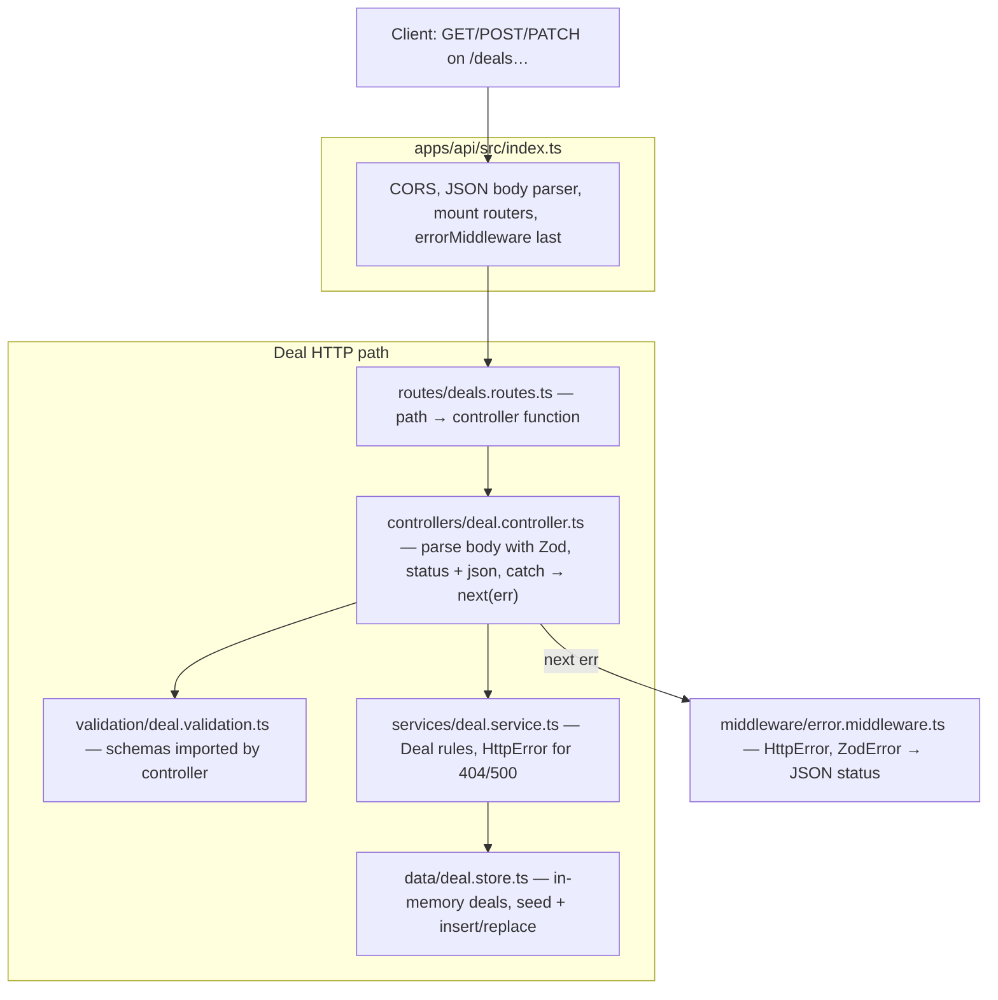
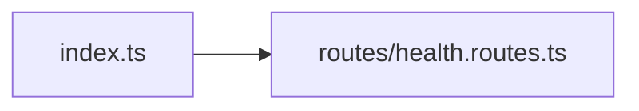

# Phase 2 — API deals REST (local notes)

**This folder (`docs/phases/`) is listed in `.gitignore`.** These files stay on your machine only and are not committed.

**How phase docs are structured (Phases 1–4):** **Scope** → **Walkthrough (slow)** (step-by-step + code references) → **Diagram** → **Key files** → **Checklist** → **Later** → **Review one-liner**.

---

## Scope (what Phase 2 was)

- Express API in **`apps/api`** on port **3000** (override with **`PORT`**).
- **`Deal`** shape from **`@otcflow/shared`**; in-memory **`deal.store`** with **`SEED_DEALS`** validated by **`DealsArraySchema`**.
- Endpoints: **`GET /`**, **`GET /health`**, **`GET /deals`**, **`GET /deals/:id`**, **`POST /deals`**, **`PATCH /deals/:id/status`**.
- Zod for **create** and **status** bodies; **`errorMiddleware`** maps **`HttpError`** and **`ZodError`** to JSON + HTTP status.
- No Postgres, auth, or web wiring yet.

Run commands and **`curl`** examples: root [README.md](../../README.md) → Local development → API.

---

## Walkthrough (slow)

Read this in order: it follows how a request hits the stack, then how it relates to a real desk and to Postgres later.

### Where the Express app starts

Everything begins in **`apps/api/src/index.ts`**. Node runs that file when you start the API (for example `tsx watch src/index.ts`).

```7:33:apps/api/src/index.ts
const app = express();

app.use(
  cors({
    origin: 'http://localhost:5173',
    methods: ['GET', 'POST', 'PATCH', 'OPTIONS'],
  })
);
app.use(express.json());

app.get('/', (_req, res) => {
  res.json({
    service: 'otcflow-api',
    message: 'REST API — use GET /health, GET /deals, POST /deals, …',
  });
});

app.use(healthRouter);
app.use(dealsRouter);

app.use(errorMiddleware);

const port = Number(process.env.PORT) || 3000;

app.listen(port, () => {
  console.log(`OTCFlow API listening on http://localhost:${port}`);
});
```

In order:

1. **`express()`** builds the app object.
2. **`cors`** and **`express.json()`** are global middleware: browser clients from the Vite origin are allowed; JSON bodies are parsed into **`req.body`** before handlers run.
3. **`app.get('/')`** is registered on **`app`** (not on a sub-router).
4. **`app.use(healthRouter)`** and **`app.use(dealsRouter)`** attach routers; paths such as **`/health`** and **`/deals`** are declared inside those files.
5. **`app.use(errorMiddleware)`** registers the **error-handling** middleware. Express only treats a function with **four** arguments **`(err, req, res, next)`** as an error handler. It must come **after** the routes so failures that reach **`next(err)`** are handled here.
6. **`app.listen`** binds the HTTP server to **`PORT`** or **3000**.

### How routes are registered

**Routers.** Each router is a mini-app. It is **`export`**ed and mounted with **`app.use(...)`** from **`index.ts`**.

**Health** — one route; the handler validates the outbound payload with shared Zod:

```4:12:apps/api/src/routes/health.routes.ts
export const healthRouter = Router();

healthRouter.get('/health', (_req, res) => {
  const payload = HealthResponseSchema.parse({
    status: 'ok',
    service: 'otcflow-api',
  });
  res.json(payload);
});
```

**Deals** — only binds URL + HTTP method → controller. No business logic:

```4:9:apps/api/src/routes/deals.routes.ts
export const dealsRouter = Router();

dealsRouter.get('/deals', dealController.listDeals);
dealsRouter.get('/deals/:id', dealController.getDealById);
dealsRouter.post('/deals', dealController.createDeal);
dealsRouter.patch('/deals/:id/status', dealController.patchDealStatus);
```

Routers are mounted at the **root** of the app, so these paths are the real paths (not under **`/api`** unless you change **`app.use`**).

**Inline route.** **`GET /`** lives on **`app`** in **`index.ts`**; it could live on a router instead—that is style only.

### What the service layer does

**`deal.service.ts`** holds **deal rules**. It does **not** use **`Request`** / **`Response`**. It takes plain inputs and returns **`Deal`** values or throws **`HttpError`**.

| Function             | Role                                                                                          |
| -------------------- | --------------------------------------------------------------------------------------------- |
| **`listDeals`**      | Return every deal from the store.                                                             |
| **`getDealById`**    | Load by id; **`HttpError(404)`** if missing.                                                 |
| **`createDeal`**     | Build a full **`Deal`**: UUID, **`createdAt`** / **`updatedAt`**, **`version: 1`**, default **`status`** if omitted, then **`insert`**. |
| **`updateDealStatus`** | Load existing, set **`status`**, bump **`version`**, refresh **`updatedAt`**, **`replace`**; 404 / 500 on failure. |

```7:55:apps/api/src/services/deal.service.ts
export function listDeals(): Deal[] {
  return dealStore.getAll();
}

export function getDealById(id: string): Deal {
  const deal = dealStore.getById(id);
  if (!deal) {
    throw new HttpError(404, 'Deal not found');
  }
  return deal;
}

export function createDeal(body: CreateDealBody): Deal {
  const now = new Date().toISOString();
  const status: DealStatus = body.status ?? 'NEW';
  const deal: Deal = {
    id: randomUUID(),
    product: body.product,
    counterparty: body.counterparty,
    notional: body.notional,
    currency: body.currency,
    price: body.price,
    status,
    trader: body.trader,
    broker: body.broker,
    createdAt: now,
    updatedAt: now,
    version: 1,
  };
  dealStore.insert(deal);
  return deal;
}

export function updateDealStatus(id: string, status: DealStatus): Deal {
  const existing = dealStore.getById(id);
  if (!existing) {
    throw new HttpError(404, 'Deal not found');
  }
  const updated: Deal = {
    ...existing,
    status,
    version: existing.version + 1,
    updatedAt: new Date().toISOString(),
  };
  const ok = dealStore.replace(updated);
  if (!ok) {
    throw new HttpError(500, 'Failed to persist deal');
  }
  return updated;
}
```

**Service** = “what does it mean to create or update a deal in this product?” **Controller** = HTTP I/O. **Store** = where rows live.

### What the in-memory store does

**`deal.store.ts`** owns a **private array** of **`Deal`**. No HTTP, no request Zod—only array operations.

- **Startup:** **`SEED_DEALS`** is validated once with **`DealsArraySchema.parse`** so seeds match the same **`Deal`** contract as real payloads.
- **`getAll`:** returns a **shallow copy** of the array (`[...this.deals]`).
- **`getById`:** **`find`** by **`id`**.
- **`insert`:** **`push`**.
- **`replace`:** find index by **`id`**, overwrite; return **`false`** if id missing.

```122:151:apps/api/src/data/deal.store.ts
export class DealStore {
  private deals: Deal[];

  constructor(initial: Deal[] = SEED_DEALS) {
    this.deals = [...initial];
  }

  getAll(): Deal[] {
    return [...this.deals];
  }

  getById(id: string): Deal | undefined {
    return this.deals.find((deal) => deal.id === id);
  }

  insert(deal: Deal): void {
    this.deals.push(deal);
  }

  /** Replace a deal with the same `id`, or no-op if missing. */
  replace(updated: Deal): boolean {
    const index = this.deals.findIndex((deal) => deal.id === updated.id);
    if (index === -1) return false;
    this.deals[index] = updated;
    return true;
  }
}

export const dealStore = new DealStore();
```

**Operational fact:** process memory only—restart the server and you are back to seed data (plus anything only lived in that process). No durability, no multi-instance consistency.

#### Shallow copy: what `getAll` actually prevents

`[...this.deals]` creates a **new array**, but each **element** is still the **same object reference** as inside `this.deals`. So:

- **Protected:** callers cannot replace or reassign the store’s **array variable** by doing `returned.push(x)` or `returned.length = 0` on the copy—those only change the **outer** array they received, not `this.deals`.
- **Not protected:** if a caller mutates **a field on one of those deal objects**, they are mutating the **same object** the store holds, so the in-memory “source of truth” changes without going through `replace` or the service.

Example (conceptual):

```ts
const snapshot = dealStore.getAll();
// snapshot !== dealStore's internal array — good

snapshot.push(/* some new Deal — only exists on snapshot */);
// Internal this.deals is unchanged — the new row is only on snapshot

snapshot[0].status = 'BOOKED';
// snapshot[0] is the SAME object reference as this.deals[0]
// So the store's row is now BOOKED — you bypassed updateDealStatus, versioning, etc.
```

**`getById`** is even more direct: `find` returns the **actual** object from `this.deals`, not a clone—any mutation hits the store immediately.

A **deep** copy (`structuredClone(deal)` per row, or mapping to new objects) would isolate callers at the cost of CPU and allocation. For this API, **`res.json(...)`** serializes to JSON, so HTTP clients never receive live object references—this matters mainly for **in-process** callers (tests, future code) that hold onto `Deal` references returned from the store.

### How validation works

Three related ideas:

1. **Incoming HTTP bodies** — **`deal.validation.ts`** describes **only what the client may send** on create / status patch (not full **`Deal`**; server fills **`id`**, timestamps, etc. on create).

```5:21:apps/api/src/validation/deal.validation.ts
export const CreateDealBodySchema = z.object({
  product: ProductTypeSchema,
  counterparty: z.string().trim().min(1).max(200),
  notional: z.number().positive(),
  currency: CurrencySchema,
  price: z.number(),
  status: DealStatusSchema.optional(),
  trader: z.string().trim().min(1).max(120),
  broker: z.string().trim().min(1).max(120),
});

export const UpdateDealStatusBodySchema = z.object({
  status: DealStatusSchema,
});
```

The **controller** calls **`.parse(req.body)`**. On failure, Zod throws **`ZodError`** → **`catch`** → **`next(err)`** → **`errorMiddleware`** → **400** with **`flatten()`** details.

```22:39:apps/api/src/controllers/deal.controller.ts
export function createDeal(req: Request, res: Response, next: NextFunction): void {
  try {
    const body = CreateDealBodySchema.parse(req.body);
    const deal = dealService.createDeal(body);
    res.status(201).json(deal);
  } catch (err) {
    next(err);
  }
}

export function patchDealStatus(req: Request, res: Response, next: NextFunction): void {
  try {
    const body = UpdateDealStatusBodySchema.parse(req.body);
    const deal = dealService.updateDealStatus(req.params.id ?? '', body.status);
    res.status(200).json(deal);
  } catch (err) {
    next(err);
  }
}
```

**GET** deal handlers do not parse a body schema.

2. **Full `Deal` rows** — **`DealSchema`** / **`DealsArraySchema`** in **`packages/shared`** for complete rows (seeds, mocks). The service builds **`Deal`** in TypeScript; you are not re-running **`DealSchema.parse`** on every write in this phase.

3. **Health** — **`HealthResponseSchema.parse`** on the outbound payload in **`health.routes.ts`**.

**Errors** — **`errorMiddleware`** maps **`HttpError`** to its **`statusCode`**, **`ZodError`** to **400**, anything else to **500**:

```22:34:apps/api/src/middleware/error.middleware.ts
  if (err instanceof HttpError) {
    res.status(err.statusCode).json({ error: err.message });
    return;
  }
  if (err instanceof ZodError) {
    res.status(400).json({
      error: 'Validation failed',
      details: err.flatten(),
    });
    return;
  }
  console.error(err);
  res.status(500).json({ error: 'Internal server error' });
```

### How version increments work

- **`createDeal`:** **`version`** is always **`1`**; **`createdAt`** and **`updatedAt`** match at insert time.
- **`updateDealStatus`:** **`version`** becomes **`existing.version + 1`**; **`updatedAt`** changes; other fields come from **`existing`**.

Seed rows carry **fixture** **`version`** values (e.g. 3, 5) so data “looks lived-in”; the app does not compute those.

In a larger system, **`version`** often supports **optimistic concurrency** (client sends expected version; **`UPDATE ... WHERE version = ?`**; **409** if no row updated). This API always increments on PATCH without checking the client’s expected version—fine for learning.

### How this maps to a real trading platform

This API is a **thin slice** of a **deal / trade blotter** service (read + simple writes), not a full execution stack.

| Endpoint / idea              | Desk analogy                                                                 |
| ---------------------------- | ---------------------------------------------------------------------------- |
| **`GET /deals`**             | Blotter / “what we know now”—often backed by a **read model** in production. |
| **`GET /deals/:id`**         | Drill-down for ops, support, or a detail screen.                             |
| **`POST /deals`**            | Stand-in for capture from **OMS**, **FIX**, voice workflow, or internal forms—usually with richer enrichment (entities, book, settlement). |
| **`PATCH .../status`**       | Simplified **lifecycle** (NEW → PENDING → MATCHED → BOOKED). Real systems add **who may transition**, **audit**, and sometimes **async** booking. |

**Not here yet:** authz by desk/role, idempotency, duplicate detection, venue/clearing integration, allocations, amendments, full audit trail, streaming UI updates.

### What changes when we add Postgres

Routes → controllers → **services** stay; the **swap** is **`DealStore`** (and transactions / concurrency).

| Area            | Today                         | With Postgres (typical)                                                                 |
| --------------- | ----------------------------- | --------------------------------------------------------------------------------------- |
| **Persistence** | In-memory array               | Tables (e.g. **`deals`**) via repository / ORM / SQL.                                   |
| **`DealStore`** | Array CRUD                    | **`DealRepository`**: **`findAll`**, **`findById`**, **`insert`**, **`update`**, maybe **`updateStatusIfVersion`**. |
| **Transactions** | Single-threaded, one array   | **`BEGIN`/`COMMIT`** for multi-step writes (deal + event + outbox).                     |
| **Concurrency** | Single Node, single array     | Multiple instances: **locking** or **optimistic `version`** in **`UPDATE ... WHERE version = ?`**. |
| **Identity**    | **`randomUUID()`** in app     | Often still UUIDs; sometimes DB keys / human-readable refs.                           |
| **Seeding**     | **`SEED_DEALS`** in code      | Migrations + seed SQL or fixtures for dev/staging.                                      |
| **Validation** | Zod at HTTP boundary          | Same at boundary; add **DB constraints** (CHECK, FK) so bad data cannot persist if Zod is bypassed. |
| **Startup**     | No DB                         | Pool, **`DATABASE_URL`**, graceful pool shutdown.                                       |
| **List**        | **`getAll`** everything       | Pagination, filters, indexes; optional read replicas for heavy blotters.                |

---

## Diagram — deal flow (files)



**Errors:** **`deal.service.ts`** throws **`HttpError`**. **`Schema.parse`** throws **`ZodError`**. The controller’s **`catch`** calls **`next(err)`** so **`errorMiddleware`** responds.

---

## Diagram — health (no store)



---

## Key files (`apps/api/src/`)

| Path                             | Role                                                                     |
| -------------------------------- | ------------------------------------------------------------------------ |
| `index.ts`                       | App wiring, middleware order, listen on **`PORT`** or **3000**.          |
| `routes/deals.routes.ts`         | Registers **`/deals`** routes; no business logic.                        |
| `routes/health.routes.ts`        | Registers **`/health`**.                                                 |
| `controllers/deal.controller.ts` | HTTP + Zod parse + service + explicit **200** / **201** + **`next(err)`**. |
| `validation/deal.validation.ts`  | Zod request bodies.                                                      |
| `services/deal.service.ts`       | Domain behavior; **`dealStore`**, **`HttpError`**.                       |
| `data/deal.store.ts`             | **`SEED_DEALS`**, **`DealStore`**, **`dealStore`**.                      |
| `middleware/error.middleware.ts` | **`HttpError`**, **`errorMiddleware`** (four-arg Express error handler). |

---

## Checklist (new deal endpoint)

1. **`deals.routes.ts`** — new route line.
2. **`deal.controller.ts`** — handler: validate if body, **`res.status(...).json(...)`**, **`catch` → `next(err)`**.
3. **`deal.service.ts`** (+ **`deal.store.ts`** only if you need new persistence primitives).
4. **`deal.validation.ts`** — new Zod schema if the request shape is new.

Keep **`HttpError`** / **`ZodError`** flowing to **`errorMiddleware`** so status mapping stays in one place.

---

## Review one-liner

_Routes stay thin; controllers own HTTP + Zod; services own rules and **`Deal`** mutations; store is a dumb array today and becomes a DB-backed repository later; one error middleware maps failures to responses._
---

## Later (Phase 3+)

**Phase 3** wired the React blotter to this API (**`GET /deals`**, **`POST /deals`**, **`PATCH /deals/:id/status`**) with TanStack Query, **`apps/web/src/api/requestJson.ts`** (shared **`fetch`**) plus **`dealsClient.ts`** (deal paths + Zod), loading/error UI, create form, detail status actions, and **query invalidation**. See **`phase-3-frontend-tanstack-query.md`**.

**Phase 4** adds **`WebSocket /ws/deals`** and shared **`DealEvent`** broadcasts after creates and status changes; the web merges into the TanStack Query cache with version guards. See **`phase-4-websocket-realtime.md`**.

**Phase 5** upgrades the web blotter to **MUI + AG Grid** while keeping the same REST + Query + WebSocket data path. See **`phase-5-mui-ag-grid.md`**.

Further ideas (not built): authz, idempotency, optimistic concurrency on **`version`**, streaming updates, Postgres-backed **`DealStore`**.
