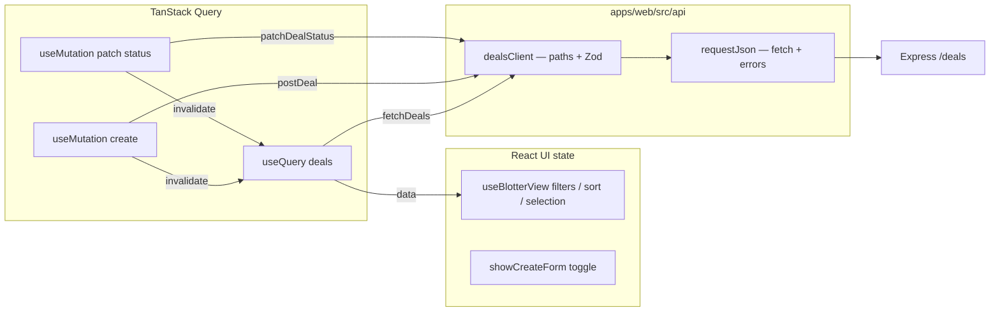

# Phase 3 — Web ↔ API with TanStack Query (local notes)

**This folder (`docs/phases/`) is listed in `.gitignore`.** These files stay on your machine only and are not committed.

**How phase docs are structured (Phases 1–4):** **Scope** → **Walkthrough (slow)** (step-by-step + code references) → **Diagram** → **Key files** → **Checklist** → **Later** → **Review one-liner**.

---

## Scope (what Phase 3 was)

- **`@tanstack/react-query`** in **`apps/web`**, with **`QueryClientProvider`** in **`main.tsx`** (**`staleTime`**, **`retry: 1`** on queries).
- **`apps/web/src/api/requestJson.ts`** — **`requestJson`**, **`getApiBaseUrl()`**, **`ApiRequestError`** (shared **`fetch`** + JSON error handling).
- **`apps/web/src/api/dealsClient.ts`** — **`fetchDeals`**, **`postDeal`**, **`patchDealStatus`** (calls **`requestJson`**, then Zod with **`DealsArraySchema`** / **`DealSchema`**); re-exports **`getApiBaseUrl`** / **`ApiRequestError`** for one import path.
- **`BlotterScreen`** — **`useQuery`** on **`dealQueryKeys.all`** replaces **`MOCK_DEALS`** as the deal list source; loading / error / background refresh UI.
- **`CreateDealForm`** — **`useMutation`** → **`POST /deals`**, **`invalidateQueries`** on success.
- **`DealDetailPanel`** — status buttons → **`PATCH /deals/:id/status`** via parent **`useMutation`**; pending + error wiring.
- **`useBlotterView`** unchanged: search, filters, sort, selection ( **UI state** over **`allDeals`** ).
- **Not added (in Phase 3):** GraphQL, Docker, Postgres, AWS, auth. (**Deal-row WebSockets** ship in **Phase 4** — see **`phase-4-websocket-realtime.md`**.)

Run **`npm run dev:api`** and **`npm run dev:web`**: root [README.md](../../README.md).

---

## Walkthrough (slow)

### How this phase was layered

1. Install **`@tanstack/react-query`**, wrap **`App`** with **`QueryClientProvider`** in **`main.tsx`**.
2. Add **`requestJson.ts`** then **`dealsClient.ts`** (HTTP layer vs deal-specific Zod).
3. Add **`queryKeys.ts`** — **`dealQueryKeys.all`** = **`['deals']`**.
4. **`BlotterScreen`**: **`useQuery({ queryKey, queryFn: fetchDeals })`**, **`data ?? []`** → **`useBlotterView`**, loading/error branches.
5. **`CreateDealForm`**: **`useMutation(postDeal)`**, invalidate on success.
6. **`BlotterScreen`**: **`useMutation(patchDealStatus)`**, pass into **`DealDetailPanel`**, invalidate on success.
7. Polish: refresh banner, **`vite-env.d.ts`**, README, CSS.

### Where TanStack Query is configured

A **`QueryClient`** is created once at module load; **`QueryClientProvider`** supplies it to the tree under **`App`**.

```7:21:apps/web/src/main.tsx
const queryClient = new QueryClient({
  defaultOptions: {
    queries: {
      staleTime: 15_000,
      retry: 1,
    },
  },
});

createRoot(document.getElementById('root')!).render(
  <StrictMode>
    <QueryClientProvider client={queryClient}>
      <App />
    </QueryClientProvider>
  </StrictMode>
);
```

**`staleTime`** controls how long list data is treated as fresh before background refetch policies apply; **`retry: 1`** limits transient network failures on queries.

### How **`GET /deals`** runs end-to-end

1. **`BlotterScreen`** registers a query with a stable key and **`fetchDeals`** as **`queryFn`**:

```19:24:apps/web/src/blotter/BlotterScreen.tsx
  const dealsQuery = useQuery({
    queryKey: dealQueryKeys.all,
    queryFn: fetchDeals,
  });

  const allDeals = dealsQuery.data ?? [];
```

2. **`dealQueryKeys.all`** is **`['deals']`**:

```1:3:apps/web/src/blotter/queryKeys.ts
export const dealQueryKeys = {
  all: ['deals'] as const,
};
```

3. **`fetchDeals`** calls **`requestJson('/deals')`**, then validates JSON as **`Deal[]`**:

```13:16:apps/web/src/api/dealsClient.ts
export async function fetchDeals(): Promise<Deal[]> {
  const json = await requestJson('/deals', { method: 'GET' });
  return DealsArraySchema.parse(json);
}
```

4. **`requestJson`** lives in **`requestJson.ts`** (not in **`dealsClient.ts`**). It performs **`fetch`**, reads the response as text, tries **`JSON.parse`**, maps non-OK HTTP to **`ApiRequestError`**, and returns **`unknown`** on success. TanStack Query owns **when** to call **`queryFn`** (mount, invalidation, refocus, etc. per defaults).

```32:72:apps/web/src/api/requestJson.ts
/** `GET`/`POST`/`PATCH` against the API; returns parsed JSON or `undefined` for empty 2xx body. Throws `ApiRequestError` on failure. */
export async function requestJson(path: string, init: RequestInit = {}): Promise<unknown> {
  const url = `${getApiBaseUrl()}${path}`;
  const method = init.method ?? 'GET';
  const headers = new Headers(init.headers);
  if (
    init.body !== undefined &&
    init.body !== null &&
    method !== 'GET' &&
    method !== 'HEAD' &&
    !headers.has('Content-Type')
  ) {
    headers.set('Content-Type', 'application/json');
  }

  let res: Response;
  try {
    res = await fetch(url, { ...init, method, headers });
  } catch (cause) {
    const message = cause instanceof Error ? cause.message : 'Network error';
    throw new ApiRequestError(`Network request failed: ${message}`, 0, cause);
  }

  const text = await res.text();
  let json: unknown;
  if (text) {
    try {
      json = JSON.parse(text) as unknown;
    } catch {
      json = text;
    }
  } else {
    json = undefined;
  }

  if (!res.ok) {
    const msg = extractErrorMessage(json, `Request failed (${res.status})`);
    throw new ApiRequestError(msg, res.status, json);
  }

  return json;
}
```

The private **`extractErrorMessage`** in the same file pulls **`{ "error": "…" }`** from API error JSON when present.

### **`requestJson.ts` vs `dealsClient.ts`**

| File | Responsibility |
| ---- | ---------------- |
| **`requestJson.ts`** | Base URL (**`VITE_API_URL`**), **`fetch`**, headers, **`ApiRequestError`**, generic JSON success **`unknown`**. Reusable for **`/health`**, future resources. |
| **`dealsClient.ts`** | Deal paths only + **`DealsArraySchema` / `DealSchema`** so the rest of the app sees **`Deal[]`** / **`Deal`**, not raw JSON. Re-exports **`getApiBaseUrl`** and **`ApiRequestError`** so callers can **`import { fetchDeals, ApiRequestError } from './dealsClient.js'`** if desired. |

### How **create** and **status update** work

**Create** — **`CreateDealForm`** uses **`useMutation`** with **`postDeal`**; on success it invalidates the deals query and resets local form state:

```33:41:apps/web/src/blotter/CreateDealForm.tsx
  const createMutation = useMutation({
    mutationFn: (body: CreateDealInput) => postDeal(body),
    onSuccess: () => {
      void queryClient.invalidateQueries({ queryKey: dealQueryKeys.all });
      setForm(defaultForm);
      setIncludeStatus(false);
      onCreated?.();
    },
  });
```

**`postDeal`** → **`POST /deals`** with JSON body, response validated as one **`Deal`**.

**Status** — **`BlotterScreen`** holds the patch mutation and passes **`handleStatusChange`** into **`DealDetailPanel`**:

```26:31:apps/web/src/blotter/BlotterScreen.tsx
  const patchStatusMutation = useMutation({
    mutationFn: ({ id, status }: { id: string; status: DealStatus }) => patchDealStatus(id, status),
    onSuccess: () => {
      void queryClient.invalidateQueries({ queryKey: dealQueryKeys.all });
    },
  });
```

**`patchDealStatus`** → **`PATCH /deals/:id/status`** with **`{ status }`**, response validated as **`Deal`**.

```37:43:apps/web/src/api/dealsClient.ts
export async function patchDealStatus(id: string, status: DealStatus): Promise<Deal> {
  const json = await requestJson(`/deals/${encodeURIComponent(id)}/status`, {
    method: 'PATCH',
    body: JSON.stringify({ status }),
  });
  return DealSchema.parse(json);
}
```

### Why query invalidation

After a successful write, the in-memory **truth** on the server may differ from the cached list (new row, new **`version`**, **`updatedAt`**, **`status`**). Calling **`queryClient.invalidateQueries({ queryKey: dealQueryKeys.all })`** marks **`['deals']`** stale and schedules a **refetch** of **`fetchDeals`**, so **`useBlotterView(allDeals)`** sees fresh data without manually merging mutation results into React state.

### Server state vs UI state

| Kind | Owned by | Examples in this phase |
| ---- | -------- | ---------------------- |
| **Server state** | TanStack Query cache | **`GET /deals`** snapshot under **`['deals']`**; **`isPending`**, **`isError`**, **`isFetching`**, **`data`**. |
| **UI state** | React **`useState`** + **`useBlotterView`** | Search, product/status filters, sort, **`selectedId`**, **`showCreateForm`**. Not persisted by these endpoints unless you add calls. |

**Why split:** filters and sort are **presentation** over the server list; they should not reset on every refetch. Rows are **authoritative** on the server; the cache is a snapshot plus lifecycle.

### How this maps to a real trading platform UI

| Phase 3 piece | Desk / platform analogue |
| ------------- | ------------------------ |
| **`GET /deals` + query cache** | Blotter / snapshot service; often a read model or paged API in production. |
| **`useBlotterView`** | Client-side filters/sort/layout state over that snapshot. |
| **`POST /deals`** | Trade capture (OMS, voice workflow, internal form)—here minimal fields only. |
| **`PATCH .../status`** | Lifecycle transition; production adds rules, audit, async booking. |
| **Invalidate → refetch** | Pull after your own writes; **Phase 4** adds **`/ws/deals`** pushes for other clients/tabs (see phase-4 doc). Broader quote/risk feeds still out of scope. |

**Not here yet:** optimistic UI with rollback, entitlements, idempotency keys, pagination, separate read/write service boundaries.

---

## Diagram — request flow (mental model)



---

## Key files (Phase 3)

| Path | Role |
| ---- | ---- |
| `apps/web/package.json` | **`@tanstack/react-query`** dependency. |
| `apps/web/src/main.tsx` | **`QueryClient`**, **`QueryClientProvider`**. |
| `apps/web/src/vite-env.d.ts` | **`VITE_API_URL`**. |
| `apps/web/src/api/requestJson.ts` | **`requestJson`**, **`getApiBaseUrl`**, **`ApiRequestError`**. |
| `apps/web/src/api/dealsClient.ts` | Deal endpoints + Zod parse; re-exports from **`requestJson`**. |
| `apps/web/src/blotter/queryKeys.ts` | **`dealQueryKeys.all`**. |
| `apps/web/src/blotter/BlotterScreen.tsx` | Query, mutations, layout branches, header toggle. |
| `apps/web/src/blotter/CreateDealForm.tsx` | Create mutation + form. |
| `apps/web/src/blotter/DealDetailPanel.tsx` | Status actions + error display. |
| `apps/web/src/blotter/blotter.css` | Loading, error, banner, form, buttons. |
| `README.md` | Dev notes, **`VITE_API_URL`**. |

**Still central from Phase 1:** **`useBlotterView.ts`**, **`BlotterToolbar.tsx`**, **`DealTable.tsx`**. **`mockDeals.ts`** remains for experiments; **`BlotterScreen`** does not import it.

---

## Checklist (review)

1. **Single list key** — **`dealQueryKeys.all`** used by query and both mutations for invalidation.
2. **Two-layer API client** — **`requestJson`** (HTTP + errors); **`dealsClient`** (paths + Zod **`Deal`** shapes).
3. **UI vs server** — filters/sort/selection not stored in the query cache.
4. **Writes → invalidate** — avoid duplicating merge logic in **`useState`**.
5. **Errors** — list load vs mutation errors surfaced separately where needed.
6. **CORS + URL** — API allows Vite origin; **`VITE_API_URL`** documented for non-default hosts.

---

## Later

- **Beyond Phase 5** — richer push feeds (quotes, risk), SSE alternatives, optimistic **`PATCH`**, pagination, auth.

---

## Review one-liner

_Server state (deals list) lives in TanStack Query under **`['deals']`**; **`requestJson`** handles HTTP and **`dealsClient`** applies Zod; **`useBlotterView`** owns filter/sort/selection UI state; mutations **invalidate** so **`GET /deals`** stays the merge-free source of truth._
