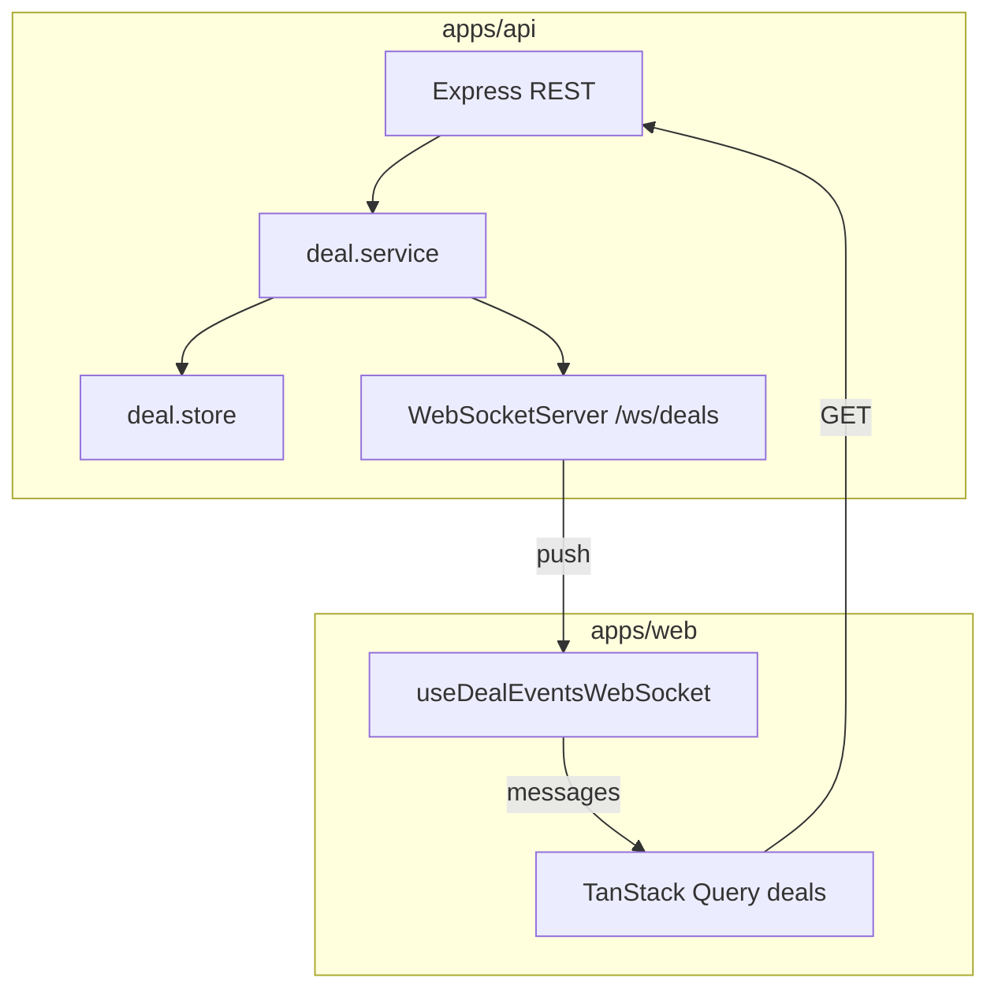

# Phase 4 — WebSocket realtime deal events (local notes)

**How phase docs are structured:** **Scope** → **Walkthrough (slow)** → **Diagram** → **Key files** → **Checklist** → **Later** → **Review one-liner** (same pattern as earlier phase notes).

---

## Scope (what Phase 4 was)

- **`packages/shared`**: **`DealEvent`** — Zod discriminated union **`DEAL_CREATED`** | **`DEAL_STATUS_CHANGED`**, each carrying a full **`Deal`** (same **`DealSchema`** as REST).
- **`apps/api`**: **`node:http`** **`createServer(app)`** (same port as Express); **`ws`** **`WebSocketServer`** on path **`/ws/deals`**; **`broadcastDealEvent`** after **`createDeal`** and **`updateDealStatus`** in **`deal.service.ts`**. Plain **`GET /ws/deals`** in the browser returns a short HTML page explaining that real clients need a WebSocket upgrade (avoids a bare **Cannot GET** when someone pastes the URL).
- **`apps/web`**: **`getDealsWebSocketUrl()`** in **`requestJson.ts`** ( **`ws:`** / **`wss:`** from **`VITE_API_URL`** ); **`useDealEventsWebSocket`** runs on **`BlotterScreen`** mount, **`JSON.parse`** + **`DealEventSchema.parse`**, then **`queryClient.setQueryData(['deals'], …)`** with **version-based ignore** (**`incoming.version <= existing.version`** → no change). **Reconnect**: exponential backoff capped at **30s** after **`onclose`**, reset attempt counter on **`onopen`**.
- **Not added:** GraphQL, Docker, Postgres, AWS, auth.

Run **`npm run dev:api`** + **`npm run dev:web`**: root [README.md](../../README.md).

---

## Walkthrough (slow)

### 1. Shared contract (`DealEvent`)

Both HTTP and WebSocket bodies must agree on the shape of a **deal**. Events wrap that shape with a **`type`** discriminator so the client can switch on **`DEAL_CREATED`** vs **`DEAL_STATUS_CHANGED`** (even though both carry **`deal`** today — useful for logging, metrics, or different UI later).

**Source:** `packages/shared/src/dealEvents.ts` — **`DealEventSchema`**, **`DealCreatedEventSchema`**, **`DealStatusChangedEventSchema`**, exported from **`packages/shared/src/index.ts`**.

### 2. API: HTTP + WebSocket on one port

Express is only an **`http.Server`** request listener. **`createServer(app)`** returns a server object that handles **`upgrade`** for WebSockets as well as normal **`request`** events.

**`apps/api/src/index.ts`** creates **`httpServer`**, calls **`attachDealsWebSocket(httpServer)`**, then **`httpServer.listen(port)`** instead of **`app.listen`**.

**`apps/api/src/ws/dealsWs.ts`**:

- **`new WebSocketServer({ server, path: '/ws/deals' })`** — only upgrade requests for that path become WebSocket connections.
- **`clients`** — a **`Set`** of sockets; add on **`connection`**, remove on **`close`**.
- **`broadcastDealEvent(event)`** — **`DealEventSchema.parse(event)`** (defensive), **`JSON.stringify`**, **`send`** to every socket in **`OPEN`** state.

### 3. When events are emitted

**`deal.service.ts`** (after persistence succeeds):

- **`createDeal`**: after **`dealStore.insert(deal)`**, **`broadcastDealEvent({ type: 'DEAL_CREATED', deal })`**.
- **`updateDealStatus`**: after **`dealStore.replace`** succeeds, **`broadcastDealEvent({ type: 'DEAL_STATUS_CHANGED', deal: updated })`**.

So every **authoritative** write fans out to all browsers; REST responses still return the same **`Deal`** JSON as before.

### 4. Web: connect and merge into TanStack Query

**`getDealsWebSocketUrl()`** — builds **`URL`** from **`getApiBaseUrl()`**, flips **`http`→`ws`**, **`https`→`wss`**, sets **`pathname`** to **`/ws/deals`**.

**`useDealEventsWebSocket`** ( **`BlotterScreen`** calls it with no args):

- **`useEffect`** on mount: **`new WebSocket(url)`**.
- **`onmessage`**: **`DealEventSchema.parse(JSON.parse(data))`**, then **`setQueryData(dealQueryKeys.all, (old) => mergeDealByVersion(old, event.deal))`** for both event kinds (same merge: full **`deal`** snapshot).
- **`mergeDealByVersion`**: if **id** missing from list → append; if present and **`incoming.version <= existing.version`** → return **`list` unchanged** (stale protection, including echo after your own **`POST`** when refetch already inserted the row at the same version).
- **`onclose`**: if component still mounted, **`setTimeout(connect, delay)`** with **`delay = min(30000, 1000 * 2**attempt**)`**, **`attempt++`** before each reconnect; **`onopen`** sets **`attempt = 0`**.
- **Cleanup**: clear timer, **`ws.close()`**, **`mountedRef = false`** so **`onclose`** does not schedule reconnect after unmount.

### 5. Interaction with REST + invalidation

Mutations still **`invalidateQueries(['deals'])`** — refetch and WebSocket updates can race; **version** ordering ensures the cache never regresses to an older **`deal`**.

---

## Diagram

---

## Key files (Phase 4)

| Path | Role |
| ---- | ---- |
| `packages/shared/src/dealEvents.ts` | **`DealEvent`** Zod + types. |
| `packages/shared/src/index.ts` | Re-exports **`DealEvent`**, schemas. |
| `apps/api/src/index.ts` | **`createServer`**, **`attachDealsWebSocket`**, listen; optional **`GET /ws/deals`** HTML for non-WS visits. |
| `apps/api/src/ws/dealsWs.ts` | **`WebSocketServer`**, **`broadcastDealEvent`**. |
| `apps/api/src/services/deal.service.ts` | Broadcast after insert / status replace. |
| `apps/web/src/api/requestJson.ts` | **`getDealsWebSocketUrl`**. |
| `apps/web/src/blotter/useDealEventsWebSocket.ts` | Socket lifecycle, cache merge, reconnect. |
| `apps/web/src/blotter/BlotterScreen.tsx` | Calls **`useDealEventsWebSocket()`**. |

---

## Checklist (review)

1. **Shared `DealEvent`** — API and web parse the same wire format with Zod.
2. **Single port** — **`http.Server`** carries both Express and **`ws`**.
3. **Broadcast after commit** — only after store **`insert`** / **`replace`** succeeds.
4. **Version guard** — ignore **`incoming.version <= cached.version`** per id.
5. **Reconnect** — backoff + cap; no reconnect after unmount.
6. **Malformed WS messages** — caught; do not corrupt cache.

---

## Later

- Heartbeat / ping-pong to detect half-open connections.
- **`DEAL_UPDATED`** for non-status field changes if the API grows.
- Redis pub/sub or DB NOTIFY if multiple API instances.

---

## Review one-liner

_Shared **`DealEvent`** validates the wire format; the API **`broadcastDealEvent`** after successful writes; the web **`setQueryData`** merges by **`deal.version`** and reconnects with backoff so the blotter stays fresh without Postgres or auth yet._

**Next:** Phase 5 (**`phase-5-mui-ag-grid.md`**) — MUI shell + AG Grid for the deal table; behaviour above unchanged.
