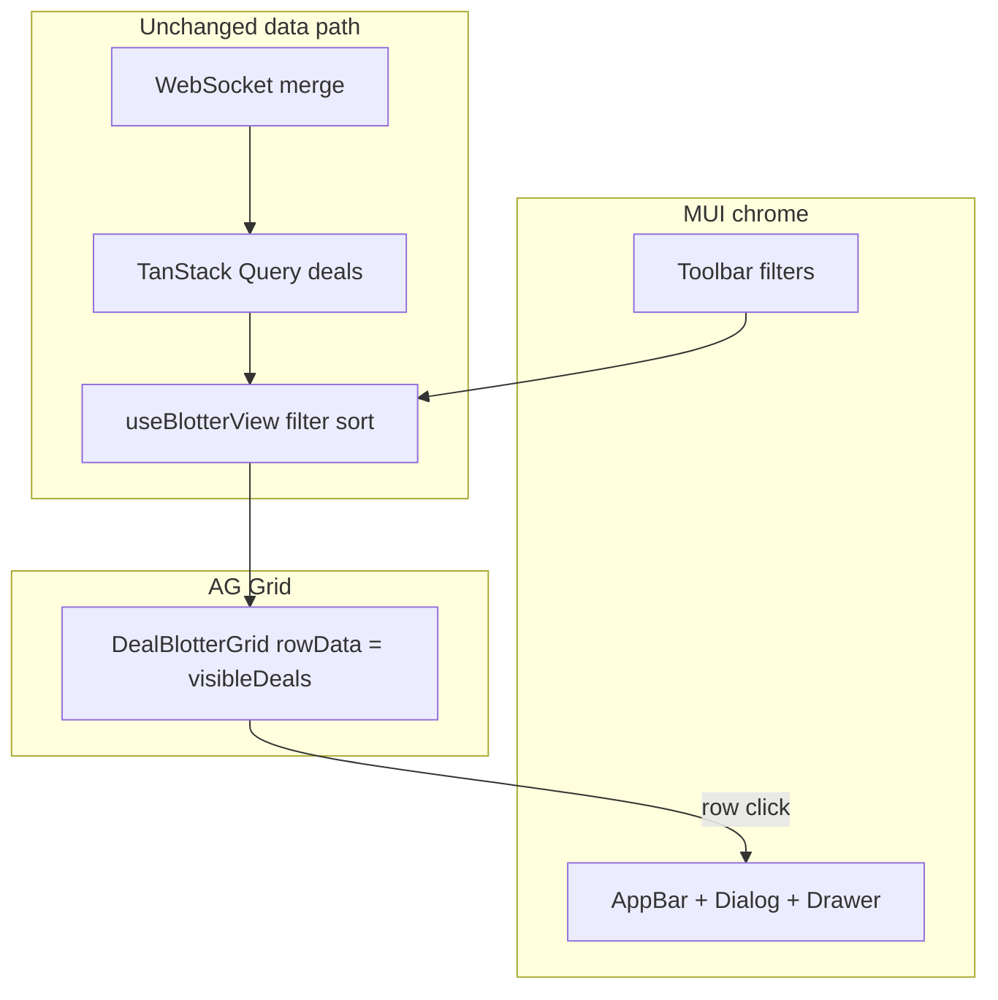

# Phase 5 — MUI + AG Grid blotter (local notes)

**How phase docs are structured:** **Scope** → **Walkthrough (slow)** → **Diagram** → **Key files** → **Checklist** → **Later** → **Review one-liner** (same pattern as earlier phase notes).

---

## Scope (what Phase 5 was)

- **`@mui/material`** + **`@emotion/*`** — **`ThemeProvider`** / **`CssBaseline`** in **`main.tsx`**; layout primitives (**`AppBar`**, **`Toolbar`**, **`Box`**, **`Paper`**, **`Dialog`**, **`Drawer`**, **`Stack`**, **`TextField`**, **`Select`**, **`Button`**, **`Chip`**, **`Alert`**, …).
- **`ag-grid-community`** + **`ag-grid-react`** — **`DealBlotterGrid`** replaces the hand-built HTML table; **`AllCommunityModule`** registered once in **`agGridSetup.ts`**; **`ag-theme-material`** CSS for visual alignment with MUI.
- **Behaviour unchanged from Phase 4:** TanStack Query **`['deals']`**, REST mutations, **`useDealEventsWebSocket`** cache merge + version guard, **`useBlotterView`** filters + sort (grid columns are **not** the source of sort — data is pre-sorted before **`rowData`**).
- **Not added:** Postgres, Docker, GraphQL, AWS, auth.

Run **`npm run dev:api`** + **`npm run dev:web`**: root [README.md](../../README.md).

---

## Why AG Grid for a trading-style blotter

OTC and cash desks live in **wide, dense tables**: many columns, large row counts, constant **inserts and cell-level updates** as quotes are refreshed, statuses change, and risk fields tick. A plain `<table>` or lightweight data table works for demos but breaks down when you need **virtualised scrolling** (only visible rows in the DOM), **pinned columns** (e.g. product + counterparty frozen left while you scroll notionals), **column resize / reorder**, **CSV export**, **aggregation**, **keyboard navigation**, and **stable performance** under churn — all standard AG Grid features.

Here we use a **small column set** and in-memory **`rowData`**, but the same component scales to **server-side row models**, **streaming updates**, and **entitlements-driven column defs** without rewriting the screen. MUI owns **chrome** (app bar, filters, dialogs, chips); AG Grid owns the **high-throughput grid surface** — a common split on real desks.

---

## Walkthrough (slow)

### 1. Theme shell

**`main.tsx`** wraps **`QueryClientProvider`** with **`ThemeProvider`** + **`CssBaseline`** so MUI components and AG Grid’s material theme sit on a consistent baseline.

### 2. Blotter shell (`BlotterScreen.tsx`)

**`AppBar`** + **New deal** opens a **`Dialog`** containing **`CreateDealForm`**. Main body: **`BlotterToolbar`** then **`DealBlotterGrid`**. **`DealDetailPanel`** is a **`Drawer`** (`anchor="right"`) driven by **`selectedDeal`**; row click sets selection via **`useBlotterView`**.

### 3. Toolbar + filters

**`BlotterToolbar.tsx`** reads the same context as before; controls are MUI **`TextField`** (counterparty search), **`Select`**s (product, status), sort **`Button`**s, and a result count.

### 4. Grid columns and formatters

**`DealBlotterGrid.tsx`** defines **`ColDef<Deal>`** for: **product**, **counterparty**, **notional**, **currency**, **price**, **status**, **trader**, **broker**, **updatedAt**. **`valueFormatter`** uses **`formatDealNotional`**, **`formatDealPrice`**, **`formatDealUpdatedAtTable`** from **`formatDealDisplay.ts`**. **`sortable: false`** on **`defaultColDef`** keeps sorting owned by **`useBlotterView`** (toolbar), not the grid header.

### 5. Status column

**`DealStatusCellRenderer.tsx`** is a React **`cellRenderer`**; it renders an MUI **`Chip`** with colour from **`dealStatusMuiColor`** in **`formatDealDisplay.ts`**.

### 6. Row selection styling

**`getRowClass`** adds **`deal-grid-row--selected`** when **`data.id === selectedId`**; **`sx`** on the theme wrapper applies **`theme.palette.action`** background for the selected row.

### 7. Detail drawer

**`DealDetailPanel.tsx`** shows fields, status **`Chip`**, and status **`Button`**s (same **`PATCH`** mutation wiring as Phase 3–4). Escape / backdrop close **`Drawer`** → **`onClose`** → **`clearSelection`**.

---

## Diagram — UI composition

---

## Key files (Phase 5)

| Path | Role |
| ---- | ---- |
| `apps/web/src/main.tsx` | **`ThemeProvider`**, **`CssBaseline`**. |
| `apps/web/src/blotter/agGridSetup.ts` | **`ModuleRegistry.registerModules([AllCommunityModule])`**. |
| `apps/web/src/blotter/DealBlotterGrid.tsx` | **`AgGridReact`**, column defs, row click, selected row class. |
| `apps/web/src/blotter/DealStatusCellRenderer.tsx` | MUI **`Chip`** cell renderer. |
| `apps/web/src/blotter/formatDealDisplay.ts` | **`dealStatusMuiColor`** + existing formatters. |
| `apps/web/src/blotter/BlotterScreen.tsx` | MUI layout, **`Dialog`**, compose grid + drawer. |
| `apps/web/src/blotter/BlotterToolbar.tsx` | MUI filter + sort controls. |
| `apps/web/src/blotter/CreateDealForm.tsx` | MUI form controls. |
| `apps/web/src/blotter/DealDetailPanel.tsx` | MUI **`Drawer`** + detail + status actions. |

---

## Checklist (review)

1. **Dependencies** — **`@mui/material`**, **`@emotion/*`**, **`@mui/icons-material`**, **`ag-grid-community`**, **`ag-grid-react`** on **`apps/web`** only.
2. **Query + WS** — no changes to **`dealsClient`**, **`useDealEventsWebSocket`**, or query keys.
3. **Filters / sort** — still **`useBlotterView`**; grid receives **`visibleDeals`** only.
4. **Column spec** — required fields + formatters + status **`Chip`** renderer.
5. **Detail UX** — row click → selection → **`Drawer`** with **`open={Boolean(selectedDeal)}`**.

---

## Later

- Code-split AG Grid (lazy **`import()`**) to shrink initial bundle.
- Column state persistence; pinned columns; CSV export.
- Grid-driven sort (optional) synced with URL or user prefs.
- Server-side row model when deals no longer fit in memory.

**Review one-liner:** Phase 5 swaps bespoke HTML/CSS for **MUI shell + AG Grid table** while keeping **React Query**, **REST**, **WebSocket cache updates**, and **useBlotterView** behaviour intact.
