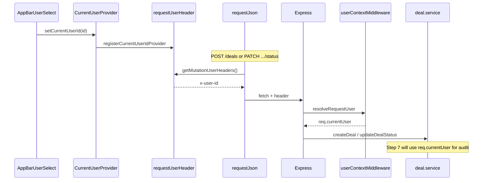

# Phase 6 — Basic user context (local notes)

**How phase docs are structured:** **Scope** → **Walkthrough (slow)** → **Diagram** → **Key files** → **Checklist** → **Later** → **Review one-liner** (same pattern as earlier phase notes).

---

## Scope (what Phase 6 was)

- **`packages/shared`**: **`User`** type — **`id`**, **`name`**, **`role`** (`BROKER` | `TRADER` | `SUPERVISOR` | `OPERATIONS`); **`MOCK_USERS`** (one user per role); **`DEFAULT_MOCK_USER_ID`**.
- **`apps/web`**: **`CurrentUserProvider`** + **`useCurrentUser()`**; **Acting as** MUI **`Select`** in the top **`AppBar`**; read-only **name · role** in the filter toolbar; **`x-user-id`** on **`POST`** / **`PATCH`** via **`requestJson`**.
- **`apps/api`**: **`user.store`** lookup; **`resolveRequestUser`** from **`x-user-id`**; **`userContextMiddleware`** sets **`req.currentUser`** on every request (default user if header missing or unknown).
- **Not added (in Phase 6):** audit trail ([Phase 7](phase-7-audit-trail.md)), JWT, sessions, RBAC enforcement, Postgres, Docker, GraphQL, AWS.

Run **`npm run dev:api`** + **`npm run dev:web`**: root [README.md](../../README.md).

---

## What problem this solves

Before audit and compliance, the platform needs a single answer to **“who is performing this action?”**

- **Attribution** — later audit rows and ops tooling need a stable actor (`id`, `name`, `role`).
- **Server hook** — handlers read **`req.currentUser`** instead of trusting body fields.
- **Desk UX** — the user sees who they are acting as before creating trades or changing status.

Phase 6 does **not** prove identity. It wires **acting-as** end-to-end so Step 7 can stamp audit events without redesigning HTTP.

---

## Walkthrough (slow)

### 1. Shared `User` type (`packages/shared/src/user.ts`)

```ts
User = { id, name, role }
```

**Why shared:** same contract on web (selector, display) and API (resolve header → user). Zod validates **`MOCK_USERS`** at module load.

Roles are **desk labels** today; later they map to RBAC permissions.

### 2. Where mock users live

| Location | Role |
| -------- | ---- |
| **`packages/shared/src/user.ts`** — **`MOCK_USERS`** | Source of truth (four users, one per role) |
| **`apps/api/src/data/user.store.ts`** | **`getUserById`**, **`getDefaultUser`**, **`listUsers`** |

Default acting user: **`user-trader-01`** (A. Chen).

### 3. Frontend — selected user state

**`BlotterScreen`** wraps the app in **`CurrentUserProvider`**:

- **`useState(DEFAULT_MOCK_USER_ID)`** → **`currentUserId`**
- **`currentUser`** = lookup in **`MOCK_USERS`**
- Context: **`{ currentUser, setCurrentUserId, users }`**
- **`useEffect`** registers **`() => currentUserId`** with **`requestUserHeader`** so **`requestJson`** can read the id without React hooks

### 4. MUI user selector

- **`AppBarUserSelect`** (top nav) — **`Select`** “Acting as”, **`onChange`** → **`setCurrentUserId`**, styled for the dark **`AppBar`**
- **`ToolbarCurrentUserDisplay`** (filter toolbar) — read-only **Acting as** + **name · role** (picker stays in nav only)

### 5. Passing user into API requests

**`postDeal`** / **`patchDealStatus`** → **`requestJson`**.

For **`POST`** and **`PATCH`** only, **`requestJson`** merges **`getMutationUserHeaders()`** → **`{ 'x-user-id': '<id>' }`**.

**Not sent today:** **`GET /deals`**, WebSocket (unchanged).

### 6. Why `x-user-id`

- Keeps deal JSON bodies unchanged (**`CreateDealBody`** stays product/counterparty/…).
- Easy to read in middleware before route handlers.
- CORS allows it: **`allowedHeaders: ['Content-Type', 'x-user-id']`**.

**Demo caveat:** any client can send any id — not production-safe.

### 7. Backend — read and resolve

**`resolveRequestUser`** (`apps/api/src/context/requestUser.ts`):

1. Read **`req.header('x-user-id')`**
2. **`getUserById(trimmed)`** → known **`User`**
3. Else **`getDefaultUser()`**

### 8. Attach to request (middleware)

**`userContextMiddleware`** (after **`express.json()`**, before routes):

```ts
req.currentUser = resolveRequestUser(req);
```

This runs on **every** request. Handlers that run after it can read **`req.currentUser`**, even when **`x-user-id`** was missing (default user is applied).

### 9. What `express.d.ts` is for (TypeScript only)

**File:** `apps/api/src/types/express.d.ts`

```ts
import type { User } from '@otcflow/shared';

declare global {
  namespace Express {
    interface Request {
      currentUser: User;
    }
  }
}

export {};
```

**Problem:** Express’s built-in **`Request`** type does not include **`currentUser`**. Without this file, **`req.currentUser = …`** in middleware and **`req.currentUser`** in controllers would be a TypeScript error.

**What it does:** **Declaration merging** — you extend the global **`Express.Request`** interface so the compiler knows every request may carry a **`User`** after middleware runs. You get autocomplete and type-checking on **`req.currentUser.id`**, **`.name`**, **`.role`**.

| | Middleware + `.d.ts` |
| --- | --- |
| **Runtime** | Middleware **assigns** `req.currentUser` on the real request object. |
| **Compile time** | `express.d.ts` tells TypeScript that property exists and its shape. |

**`export {}`:** makes the file a **module** so `declare global` is valid (standard pattern for ambient augmentations).

**Review one-liner:** “It’s the Express type augmentation so **`req.currentUser`** is a typed **`User`** everywhere in the API after user-context middleware — the file does not run at runtime.”

### 10. Create deal / update status today

**`req.currentUser` is available** on **`createDeal`** and **`patchDealStatus`** after middleware.

**Controllers pass `req.currentUser` into `deal.service`** — Phase 7 uses it when appending **`AuditEvent`** rows ([phase-7 walkthrough](phase-7-audit-trail.md)).

To verify in dev: create or change status with different **Acting as** users; drawer **Audit history** should show the matching actor.

### 11. Deliberately not real auth

| Not built | Why |
| --------- | --- |
| Login / JWT / sessions | No identity proof |
| RBAC enforcement | Roles are labels only |
| Trusting `x-user-id` | Client can spoof |
| User on WebSocket | WS path unchanged |
| Audit trail | Step 7 |

---

## Diagram — request flow



**Linear review chain:**

```
Frontend user selector (AppBar)
  → selected user state/context (CurrentUserProvider)
  → API client (requestJson + dealsClient)
  → x-user-id header
  → backend middleware + resolveRequestUser
  → req.currentUser
  → deal service action (user available; audit in Step 7)
```

---

## Key files (Phase 6)

| Path | Role |
| ---- | ---- |
| `packages/shared/src/user.ts` | **`User`**, roles, **`MOCK_USERS`**, default id |
| `apps/web/src/blotter/CurrentUserProvider.tsx` | State + context + register id for HTTP |
| `apps/web/src/blotter/currentUserContext.ts` | **`useCurrentUser()`** hook |
| `apps/web/src/blotter/AppBarUserSelect.tsx` | Top nav **Acting as** dropdown |
| `apps/web/src/blotter/ToolbarCurrentUserDisplay.tsx` | Toolbar name · role display |
| `apps/web/src/blotter/BlotterAppBar.tsx` | App bar composes title + user select + New trade |
| `apps/web/src/api/requestUserHeader.ts` | Provider bridge → **`getMutationUserHeaders()`** |
| `apps/web/src/api/requestJson.ts` | Attaches **`x-user-id`** on POST/PATCH |
| `apps/api/src/context/requestUser.ts` | **`resolveRequestUser`**, **`USER_ID_HEADER`** |
| `apps/api/src/middleware/userContext.middleware.ts` | Sets **`req.currentUser`** |
| `apps/api/src/data/user.store.ts` | Mock user lookup |
| `apps/api/src/types/express.d.ts` | **`Request.currentUser`** typing |
| `apps/api/src/index.ts` | CORS + **`userContextMiddleware`** |

**Three files to know cold:**

1. **`packages/shared/src/user.ts`** — contract + mock list  
2. **`apps/web/src/blotter/CurrentUserProvider.tsx`** — UI state + HTTP bridge  
3. **`apps/api/src/context/requestUser.ts`** + **`userContext.middleware.ts`** — server resolution

---

## How this evolves (auth / RBAC)

| Phase 6 (now) | Production |
| ------------- | ---------- |
| Toolbar / nav picks mock user | Login → JWT or session cookie |
| **`x-user-id`** header | **`Authorization: Bearer`** or HttpOnly session |
| **`resolveRequestUser`** reads header | Verify token, load user from claims/DB |
| **`MOCK_USERS`** | IAM / user directory |
| **`role` for display** | RBAC (e.g. only OPS can **BOOKED**) |
| **`req.currentUser`** | Same attachment point |

Replace **resolver** implementation; keep **`req.currentUser`** shape.

---

## Phase 7 — audit trail uses this

Phase 7 appends **immutable `AuditEvent`** rows on create/status (and later amend/price), embedding:

```ts
user: { id: req.currentUser.id, name: req.currentUser.name, role: req.currentUser.role }
```

- **Deal** = mutable current state (blotter row)  
- **`AuditEvent`** = append-only history attributed to **`User`**  
- **`DealEvent`** (WebSocket) = ephemeral snapshot for realtime grid — separate concern

Details: [phase-7-audit-trail.md](phase-7-audit-trail.md).

---

## Checklist (review)

1. **`User`** + **`MOCK_USERS`** exported from **`@otcflow/shared`**.
2. **Nav** has **Acting as** select; **toolbar** shows current name · role.
3. **`POST /deals`** and **`PATCH /deals/:id/status`** send **`x-user-id`** (Network tab).
4. API **`req.currentUser`** matches selected mock user (log in controller).
5. Unknown/missing header → default trader.
6. **GET**, WebSocket, AG Grid, TanStack Query, filters unchanged.

---

## Later

- **`GET /users`** optional if mock list moves server-only.
- Replace header with JWT/session; RBAC on status transitions.
- WebSocket connection auth + correlation id.

**Review one-liner:** Phase 6 adds a **shared `User` model**, **UI acting-as** (nav select + toolbar display), and **`x-user-id` → `req.currentUser`** so Step 7 can attribute audit events without rebuilding request handling.
