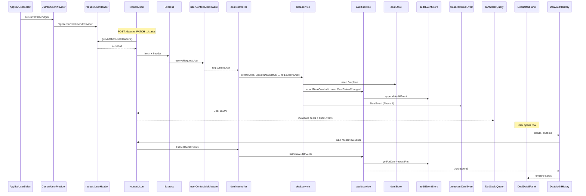

# Phase 7 — Audit trail and event history (local notes)

**How phase docs are structured:** **Scope** → **Walkthrough (slow)** → **Diagram** → **Key files** → **Checklist** → **Later** → **Review one-liner** (same pattern as earlier phase notes).

---

## Scope (what Phase 7 was)

- **`packages/shared`**: unified **`AuditEvent`** — **`id`**, **`dealId`**, **`type`**, **`timestamp`**, **`user`**, **`summary`**, **`previousValue`**, **`newValue`**, **`version`**; types **`DEAL_CREATED`**, **`DEAL_STATUS_CHANGED`**, **`DEAL_AMENDED`**, **`DEAL_PRICE_CHANGED`** (latter two in schema only until amend/price APIs exist).
- **`apps/api`**: append-only **`auditEventStore`**; **`audit.service`** **`recordDealCreated`** / **`recordDealStatusChanged`**; **`deal.service`** calls audit after **`dealStore`** write using **`req.currentUser`**; **`GET /deals/:id/events`** (newest first); startup **`seedAuditCreatedEventsFromDeals`** for seed rows.
- **`apps/web`**: **`DealAuditHistory`** in deal detail **`Drawer`**; TanStack Query **`['deals', dealId, 'auditEvents']`**; invalidate on create, status patch, and WebSocket deal updates.
- **Not added:** Postgres, JWT, RBAC enforcement, Docker, GraphQL, AWS.

**Requires Phase 6:** **`x-user-id`** → **`req.currentUser`** ([phase-6 walkthrough](phase-6-user-context.md)).

Run **`npm run dev:api`** + **`npm run dev:web`**: root [README.md](../../README.md).

---

## What problem this solves

A blotter row shows **current** trade state. Compliance and ops need **history**: who created or changed a ticket, when, and what changed.

| Need | Phase 7 answer |
| ---- | -------------- |
| **Attribution** | Each **`AuditEvent`** embeds a snapshot of **`User`** from **`req.currentUser`** at write time. |
| **Immutability** | Append-only store — no update/delete API for audit rows. |
| **Separation** | **`Deal`** (mutable) vs **`AuditEvent`** (facts) vs **`DealEvent`** (WebSocket snapshot for live grid). |
| **Desk UX** | Detail drawer shows a **newest-first** timeline without leaving the blotter. |

Phase 7 does **not** prove identity (still demo **`x-user-id`**) or persist across API restarts (in-memory only).

---

## Walkthrough (slow)

### 1. Shared `AuditEvent` (`packages/shared/src/auditEvent.ts`)

```ts
AuditEvent = {
  id, dealId, type, timestamp,
  user: { id, name, role },  // snapshot at event time
  summary, previousValue, newValue, version
}
```

**Why shared:** API writes and web **`fetchDealAuditEvents`** parse the same Zod schema — no drift between timeline UI and **`GET /deals/:id/events`**.

**Distinct from `DealEvent`:** WebSocket messages carry the **latest deal snapshot** for realtime blotter merge. **`AuditEvent`** is the **compliance-oriented append-only trail** (not broadcast on WS today).

### 2. Three stores / message kinds (say this in review)

| Concept | Storage / channel | Mutable? | Question |
| ------- | ----------------- | -------- | -------- |
| **`Deal`** | **`dealStore`** | Yes — row replaced on change | What is the trade **now**? |
| **`AuditEvent`** | **`auditEventStore`** | No — append only | What **happened**, and **who** did it? |
| **`DealEvent`** | WebSocket **`/ws/deals`** | N/A (ephemeral push) | Push latest snapshot to all clients |

### 3. Frontend — user selects current user (Phase 6)

**`CurrentUserProvider`** (wraps **`BlotterScreen`**):

- **`useState(DEFAULT_MOCK_USER_ID)`** → **`currentUserId`**
- **`useEffect`** registers **`() => currentUserId`** with **`requestUserHeader`**

**`AppBarUserSelect`** — **Acting as** MUI **`Select`** → **`setCurrentUserId`**.

Mutations (**`POST`**, **`PATCH`**) only: **`requestJson`** merges **`getMutationUserHeaders()`** → **`{ 'x-user-id': '<id>' }`**.

**Not sent on `GET /deals/:id/events`** — reading history does not need an actor header.

### 4. User creates or updates a deal

| Action | UI | API client | Route |
| ------ | -- | ---------- | ----- |
| **Create** | **`CreateDealForm`** → **`postDeal`** | **`dealsClient.ts`** | **`POST /deals`** |
| **Status** | **`DealDetailPanel`** buttons → **`BlotterScreen`** **`patchStatusMutation`** | **`patchDealStatus`** | **`PATCH /deals/:id/status`** |

Both flow through **`requestJson`** with **`x-user-id`** attached.

### 5. Backend — resolve request user (Phase 6, unchanged)

**`userContextMiddleware`** (global, before routes):

```ts
req.currentUser = resolveRequestUser(req);  // x-user-id → User, else default
```

**`deal.controller`** passes **`req.currentUser`** into the service:

```ts
dealService.createDeal(body, req.currentUser);
dealService.updateDealStatus(id, body.status, req.currentUser);
```

### 6. Deal service — mutate current deal state

**`deal.service.ts`** is the **write orchestration hub**. Order on every mutation:

1. **Persist** to **`dealStore`** (**`insert`** or **`replace`**)
2. **Append** audit via **`audit.service`**
3. **Broadcast** **`DealEvent`** on WebSocket (Phase 4, unchanged)

**Create** (`createDeal`):

```ts
dealStore.insert(deal);
recordDealCreated(deal, user);
broadcastDealEvent({ type: 'DEAL_CREATED', deal });
```

**Status** (`updateDealStatus`):

```ts
const previousStatus = existing.status;
dealStore.replace(updated);
recordDealStatusChanged(updated, user, previousStatus, status);
broadcastDealEvent({ type: 'DEAL_STATUS_CHANGED', deal: updated });
```

**Review point:** Audit runs **after** the deal row is saved so **`event.version`** matches post-mutation **`deal.version`**.

### 7. Audit service — record immutable event

**Only write path:** **`appendAuditEvent`** → **`auditEventStore.append(event)`**.

- **`recordDealCreated(deal, user)`** — type **`DEAL_CREATED`**, **`previousValue: null`**, **`newValue: deal.status`**, timestamp **`deal.createdAt`**
- **`recordDealStatusChanged(deal, user, prev, next)`** — type **`DEAL_STATUS_CHANGED`**, summary + **`previousValue` / `newValue`** as status strings

**`user` on the event** is **`toAuditUser(user)`** — a **snapshot** `{ id, name, role }`, not a live DB join. Renaming a mock user later does not rewrite old rows.

**`audit.store.ts`:** only **`append`** and **`getForDealNewestFirst`** — no update/delete methods (immutability by API surface).

**Startup:** **`seedAuditCreatedEventsFromDeals`** appends synthetic **`DEAL_CREATED`** for each seed deal (default user as actor) so pre-existing rows have a trail after restart.

### 8. Read API — `GET /deals/:id/events`

**Route order** (`deals.routes.ts`) — **`/events`** before **`/:id`**:

```ts
dealsRouter.get('/deals/:id/events', dealController.listDealAuditEvents);
dealsRouter.get('/deals/:id', dealController.getDealById);
```

**`listDealAuditEvents`:** **404** if deal id missing; else **`auditEventStore.getForDealNewestFirst(dealId)`** (sort by **`timestamp`**, descending).

### 9. Frontend — fetch audit history

**`fetchDealAuditEvents(dealId)`** in **`dealsClient.ts`** — **`GET`**, parse with **`AuditEventsArraySchema`**.

**`DealAuditHistory`** — **`useQuery`** when drawer is open:

```ts
queryKey: dealQueryKeys.auditEvents(dealId)  // ['deals', dealId, 'auditEvents']
queryFn: () => fetchDealAuditEvents(dealId)
enabled: open && deal !== null
```

**Cache refresh:**

| Trigger | Invalidates |
| ------- | ----------- |
| **`CreateDealForm`** **`onSuccess`** | **`dealQueryKeys.all`** + **`auditEvents(deal.id)`** |
| **`BlotterScreen`** status **`onSuccess`** | same for **`variables.id`** |
| **`useDealEventsWebSocket`** on valid message | **`auditEvents(parsed.deal.id)`** (other tab / client changed deal) |

REST still **`invalidateQueries(['deals'])`**; WebSocket still merges by **`deal.version`** — audit is a **separate** query key.

### 10. MUI detail drawer — render audit history

**`DealDetailPanel`** — right **`Drawer`**: trade fields + status buttons, then divider + **Audit history** section.

**`DealAuditHistory`** maps each **`AuditEvent`** to **`AuditEventCard`**:

- Type label (**`formatAuditEventType`**)
- Version chip **`v{n}`**
- Timestamp, **name · role**
- **`summary`**
- Optional **`previousValue → newValue`** (status changes)

Loading / error / empty states handled in **`DealAuditHistory`** (not the panel).

### 11. Where events are created (summary table)

| When | Where | Type |
| ---- | ----- | ---- |
| API startup | **`seedAuditCreatedEventsFromDeals`** | **`DEAL_CREATED`** |
| **`POST /deals`** | **`createDeal`** → **`recordDealCreated`** | **`DEAL_CREATED`** |
| **`PATCH /deals/:id/status`** | **`updateDealStatus`** → **`recordDealStatusChanged`** | **`DEAL_STATUS_CHANGED`** |

**Not emitted yet:** **`DEAL_AMENDED`**, **`DEAL_PRICE_CHANGED`** (schema ready for future endpoints).

### 12. Compliance / operational auditability (OTC)

Desks and regulators care about **who did what, when, and what changed**. Phase 7 records **actor**, **timestamp**, **summary**, and **deltas** on status — enough for dispute replay and control testing in a demo.

| Phase 7 (now) | Production |
| ------------- | ---------- |
| In-memory **`auditEventStore`** | Postgres **`audit_events`** (same transaction as deal update) |
| Client **`x-user-id`** | JWT / session → verified **`req.currentUser`** |
| Read via **`GET …/events`** | Optional SIEM export, WORM / signed batches |
| Drawer timeline | Same UX; possibly role-gated “view audit” |

### 13. Deliberately not built

| Not built | Why |
| --------- | --- |
| Durable DB | Step scope — in-memory only |
| Audit on WebSocket | History is pull (**`GET`**) not push |
| **`DEAL_AMENDED` / `DEAL_PRICE_CHANGED` writers** | No amend/price routes yet |
| Tamper-evident / WORM storage | Later compliance hardening |
| RBAC on “view audit” | Roles are labels only (Phase 6) |

---

## Diagram — full flow (create / status + read)



**Linear review chain:**

```
User selects Acting as (AppBar)
  → CurrentUserProvider + requestUserHeader
  → POST /deals or PATCH /deals/:id/status (requestJson + x-user-id)
  → userContextMiddleware → req.currentUser
  → deal.controller → deal.service
  → dealStore mutate (current state)
  → audit.service append (immutable history)
  → broadcastDealEvent (live blotter, separate concern)
  → invalidate auditEvents query
User opens deal drawer
  → DealAuditHistory useQuery
  → GET /deals/:id/events
  → MUI timeline (newest first)
```

---

## Key files (Phase 7)

| Path | Role |
| ---- | ---- |
| `packages/shared/src/auditEvent.ts` | **`AuditEvent`**, types, Zod; comment vs **`DealEvent`**. |
| `packages/shared/src/index.ts` | Re-exports audit types/schemas. |
| `apps/api/src/data/audit.store.ts` | Append-only in-memory log; **`getForDealNewestFirst`**. |
| `apps/api/src/services/audit.service.ts` | **`appendAuditEvent`**, **`recordDeal*`**, **`listDealAuditEvents`**, seed helper. |
| `apps/api/src/services/deal.service.ts` | Orchestrates deal write → audit → WebSocket. |
| `apps/api/src/controllers/deal.controller.ts` | Passes **`req.currentUser`**; **`listDealAuditEvents`**. |
| `apps/api/src/routes/deals.routes.ts` | **`GET …/events`** before **`GET …/:id`**. |
| `apps/api/src/data/deal.store.ts` | Calls **`seedAuditCreatedEventsFromDeals`** on startup. |
| `apps/web/src/api/dealsClient.ts` | **`fetchDealAuditEvents`**. |
| `apps/web/src/blotter/queryKeys.ts` | **`auditEvents(dealId)`** key factory. |
| `apps/web/src/blotter/DealAuditHistory.tsx` | Query + timeline UI. |
| `apps/web/src/blotter/DealDetailPanel.tsx` | **`Drawer`** + embeds **`DealAuditHistory`**. |
| `apps/web/src/blotter/formatAuditEventType.ts` | Human labels for event types. |
| `apps/web/src/blotter/CreateDealForm.tsx` | Invalidates audit on create. |
| `apps/web/src/blotter/BlotterScreen.tsx` | Invalidates audit on status patch. |
| `apps/web/src/blotter/useDealEventsWebSocket.ts` | Invalidates audit on WS deal update. |

**Three files to know cold:**

1. **`apps/api/src/services/deal.service.ts`** — every material deal write: **store → audit → broadcast**; pass **`user`** from controller.  
2. **`apps/api/src/services/audit.service.ts`** — what gets logged (summaries, deltas, user snapshot, versioning).  
3. **`apps/web/src/blotter/DealAuditHistory.tsx`** — read path: Query, loading/error/empty, **`AuditEvent` → cards**.

**Honorable mention:** **`apps/api/src/data/audit.store.ts`** — immutability = **only `append`**, no mutate/delete API.

---

## How this evolves

| Phase 7 (now) | Next |
| ------------- | ---- |
| In-memory append | **`audit_events`** table; same transaction as **`deals`** update |
| Create + status only | **`DEAL_AMENDED`**, **`DEAL_PRICE_CHANGED`** from new routes |
| **`GET /deals/:id/events`** | Optional audit stream / SIEM; export for regulators |
| Demo **`x-user-id`** | Verified identity; **`user` on event** from claims, not header |
| Drawer feed | Role-gated audit view; filter by type/date |

Keep **`deal.service`** as the single orchestration point so new mutations always append audit in one place.

---

## Checklist (review)

1. **`AuditEvent`** + **`AuditEventsArraySchema`** exported from **`@otcflow/shared`**.
2. **Acting as** user in app bar → **`POST` / `PATCH`** send **`x-user-id`** → audit row shows that **name · role**.
3. **Create trade** → **`DEAL_CREATED`** in drawer timeline (newest at top).
4. **Change status** → **`DEAL_STATUS_CHANGED`** with **`previous → new`** status line.
5. **Second browser tab** — WS update invalidates **`auditEvents`** for that deal id.
6. **`GET /deals/:id/events`** → **404** for unknown deal id; **200** array newest-first for real id.
7. **`dealStore`** row updates; audit rows **never** edited in place (only new appends).
8. WebSocket still updates blotter; audit is **not** duplicated on WS wire.

---

## Later

- Persist **`audit_events`**; transactional write with deal update.
- Emit **`DEAL_AMENDED`** / **`DEAL_PRICE_CHANGED`** from amend/price endpoints.
- Replace **`x-user-id`** with JWT; RBAC on status transitions and audit visibility.
- Stream audit to SIEM; signed batches for WORM storage.

---

## Review one-liner

Phase 7 keeps **mutable `Deal` state** and **append-only `AuditEvent` history** separate: **`deal.service`** writes the row, **`audit.service`** stamps **`req.currentUser`**, **`GET /deals/:id/events`** feeds a **newest-first drawer timeline**, with cache invalidation on mutations and WebSocket updates — in-memory only until Postgres.

**Builds on:** [phase-6-user-context.md](phase-6-user-context.md) (**`req.currentUser`**). **Related:** [phase-4-websocket-realtime.md](phase-4-websocket-realtime.md) (**`DealEvent`** broadcast).
