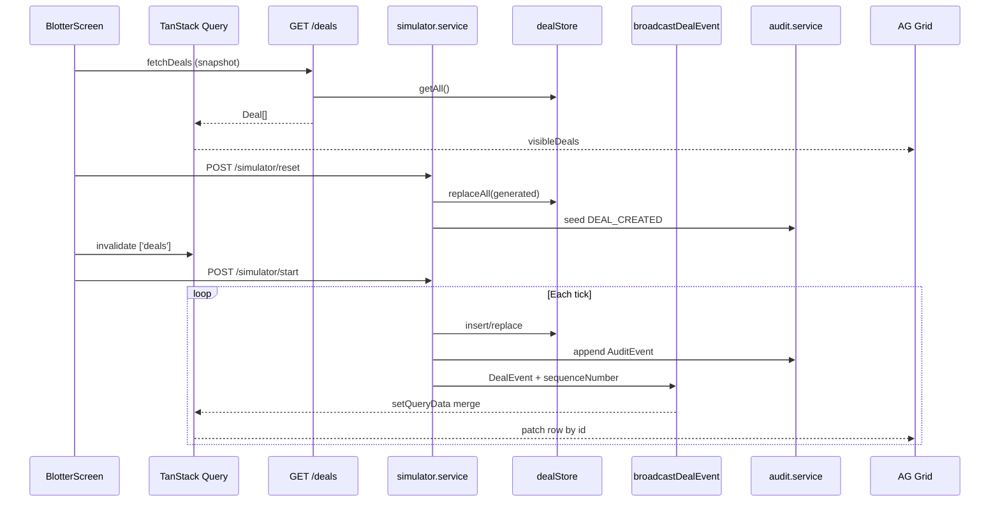

# Phase 8 — Market / event simulator (local notes)

**How phase docs are structured:** **Scope** → **Walkthrough (slow)** → **Diagram** → **Key files** → **Checklist** → **Later** → **Review one-liner** (same pattern as earlier phase notes).

---

## Scope (what Phase 8 was)

- **`packages/shared`**: extended **`DealEvent`** — **`DEAL_PRICE_CHANGED`**, **`DEAL_AMENDED`**, plus **`sequenceNumber`** on every WS message; **`SimulatorStatus`** + start/reset body schemas; **`SIMULATOR_SYSTEM_USER`**; **`SIMULATOR_DEFAULT_INTERVAL_MS`** (1000).
- **`apps/api`**: **`dealGenerator`** (500–5,000 realistic rows); **`simulator.service`** background **`setInterval`** tick loop; **`POST /simulator/start|stop|reset`**, **`GET /simulator/status`**; simulator writes use **`getSimulatorUser()`** for audit; **`streamEpoch`** bumps on reset so clients realign sequence guards.
- **`apps/web`**: **`BlotterSimulatorControls`** in toolbar; **`useDealEventsWebSocket`** merges by **`sequenceNumber`** then **`deal.version`**; AG Grid **`suppressScrollOnNewData`**, **`animateRows={false}`**; default blotter sort **`createdAt`** (stable scroll during live updates).
- **Not added:** Postgres, Docker, GraphQL, AWS, JWT, server-side pagination.

**Builds on:** [phase-4-websocket-realtime.md](phase-4-websocket-realtime.md) (WS + cache merge), [phase-7-audit-trail.md](phase-7-audit-trail.md) (audit on every write).

Run **`npm run dev:api`** + **`npm run dev:web`**. After editing **`@otcflow/shared`**, run **`npm run build --workspace=@otcflow/shared`**.

---

## What problem this solves

Before Phase 8, the blotter only changed when a **human** created or updated a trade. That is fine for CRUD demos but not for a **live desk feel**.

| Need | Phase 8 answer |
| ---- | -------------- |
| **Volume** | Reset loads **500–5,000** varied deals in memory. |
| **Live flow** | Background loop emits WS events without UI clicks. |
| **Realistic book** | Products, parties, notionals, prices, statuses, timestamps vary by rules. |
| **Safe merge** | **`sequenceNumber`** (stream) + **`version`** (per deal) drop stale/out-of-order deltas. |
| **Compliance** | Simulator uses **Market Simulator** system user on audit rows (Phase 7). |

---

## Walkthrough (slow)

### 1. Initial snapshot (what it is)

**Definition:** the **authoritative baseline** of current trade state at a point in time.

| Piece | Implementation |
| ----- | -------------- |
| **API** | **`GET /deals`** → **`dealStore.getAll()`** — full in-memory array, no pagination. |
| **Web** | TanStack Query **`['deals']`** — **`fetchDeals()`** on **`BlotterScreen`** mount. |
| **When refreshed** | Page load; manual refetch; **simulator Reset** (`invalidateQueries`); WebSocket **reconnect** (gap fill). |

The snapshot answers: *“What does the book look like right now?”* It is **not** the event log — that is audit + WS history.

**Cold start:** 8 seed deals in **`deal.store`** + audit seeded from **`index.ts`** (avoids circular import with **`audit.service`**).

**After Reset:** **`POST /simulator/reset`** replaces the book with **N** generated deals (default **2000**, clamp **500–5000**).

### 2. Live delta stream (what it is)

**Definition:** incremental **messages** that patch client state after the snapshot — without reloading the full book on every tick.

| Piece | Implementation |
| ----- | -------------- |
| **Transport** | WebSocket **`ws://…/ws/deals`** (Phase 4 path, same port as REST). |
| **Payload** | **`DealEvent`** — discriminated **`type`** + full **`deal`** snapshot + **`sequenceNumber`**. |
| **Types today** | **`DEAL_CREATED`**, **`DEAL_STATUS_CHANGED`**, **`DEAL_PRICE_CHANGED`**, **`DEAL_AMENDED`**. |
| **Publisher** | Manual **`deal.service`** writes **and** **`simulator.service`** ticks. |

Deltas are **ephemeral pushes** (fire-and-forget). Missed messages while disconnected are **not** replayed — reconnect triggers a **full snapshot refetch**.

**Distinct from audit:** WS = fast UI; **`GET /deals/:id/events`** = durable history (Phase 7).

### 3. How the simulator generates realistic data

**File:** `apps/api/src/simulator/dealGenerator.ts`

| Dimension | Approach |
| --------- | -------- |
| **Products** | Random from all **`PRODUCT_TYPE_VALUES`** (IRS, CDS, FX_*, etc.). |
| **Counterparties / traders / brokers** | Named pools; **`pick()`** biases toward earlier entries (skewed distribution). |
| **Currency** | GBP / USD / EUR. |
| **Status** | Weighted: more PENDING/MATCHED than CANCELLED. |
| **Notional** | Tiered bases (500k–250M) with jitter. |
| **Price** | **`priceForProduct()`** — sensible ranges per asset class. |
| **Timestamps** | **`createdAt`** / **`updatedAt`** spread over last ~14 days on bulk generate; live creates use “now”. |
| **Version** | Starts at 1 on create; **`bumpDeal()`** increments on each simulated change. |

**Bulk load:** **`generateDeals(count)`** → **`dealStore.replaceAll(deals)`** on reset.

### 4. How the event loop works

**File:** `apps/api/src/services/simulator.service.ts`

```
POST /simulator/start  →  setInterval(tick, intervalMs)   [default 1000ms]
POST /simulator/stop   →  clearInterval
POST /simulator/reset  →  stop, clear audit, replace deals, seed audit, reset sequence + streamEpoch
GET  /simulator/status →  running, counts, lastSequenceNumber, streamEpoch, intervalMs
```

**Each `tick()`:**

1. **35% chance** — no event (quiet period).
2. Else weighted random:
   - **12%** — **`emitCreate()`** (if book &lt; 5000)
   - **35%** — **`emitStatusChange()`**
   - **30%** — **`emitPriceChange()`**
   - **23%** — **`emitAmend()`** (counterparty, trader, broker, or notional)

**Per emit (same pattern as manual writes):**

1. Mutate **`dealStore`**
2. Append **`audit.service`** record (**`getSimulatorUser()`**)
3. **`broadcastDealEvent({ type, deal })`** → assigns **`sequenceNumber`**

### 5. `sequenceNumber` and `version` — stale protection

Two layers — **stream order** vs **per-trade logical clock**.

| Guard | Scope | Rule | Handles |
| ----- | ----- | ---- | ------- |
| **`sequenceNumber`** | Whole WS stream | Client drops if **`incoming.seq <= lastApplied`** | Reordered duplicates on the wire |
| **`deal.version`** | Single trade id | Client drops if **`incoming.version <= cached.version`** | Stale snapshot for same id, echo after own mutation |

**Server:** `apps/api/src/ws/dealsWs.ts` — monotonic **`nextSequenceNumber`**; **`resetDealEventSequence(0)`** on simulator reset.

**Client:** `apps/web/src/blotter/useDealEventsWebSocket.ts`

- Updates **`lastSequenceRef`** after accepting an event.
- **`mergeDealByVersion`** patches **`['deals']`** cache by id.
- **`streamEpoch`** on simulator reset — realigns sequence refs when status query updates (avoid ignoring events 1…N after reset).

**Reconnect:** on **`onopen`** after backoff, **`invalidateQueries(['deals'])`** — snapshot gap fill.

### 6. WebSocket → TanStack Query cache

```
ws.onmessage
  → DealEventSchema.parse
  → if sequenceNumber stale: return
  → setQueryData(['deals'], old => mergeDealByVersion(old, event.deal))
  → invalidateQueries(['deals', dealId, 'auditEvents'])  // drawer timeline refresh
```

**`BlotterScreen`** reads **`dealsQuery.data`** → **`useBlotterView`** filters/sorts → **`DealBlotterGrid`**.

No second store — the query cache **is** the client-side book for the UI.

### 7. AG Grid at larger row counts

| Technique | Why |
| --------- | --- |
| **Row virtualization** | AG Grid only renders visible rows (Community module). |
| **`getRowId={(p) => p.data.id}`** | Stable identity across updates. |
| **`animateRows={false}`** | Avoid animation cost on frequent deltas. |
| **`suppressScrollOnNewData`** | Don’t jump scroll position when **`rowData`** updates in place. |
| **Default sort `createdAt` desc** | Simulator updates **`updatedAt`** — sorting by Updated constantly reorders rows and feels like “scroll reset”. **Updated** sort shows a toolbar hint. |

**Not implemented:** server-side row model, pagination — fine for ≤5k in-memory demo; production would paginate or filter server-side.

### 8. Simulator actions → audit events

**Actor:** **`SIMULATOR_SYSTEM_USER`** — `{ id: 'user-system-simulator', name: 'Market Simulator', role: 'OPERATIONS' }` — not in the Acting-as picker.

| Simulated action | Audit type | WS type |
| ---------------- | ---------- | ------- |
| Create | **`DEAL_CREATED`** | **`DEAL_CREATED`** |
| Status change | **`DEAL_STATUS_CHANGED`** | **`DEAL_STATUS_CHANGED`** |
| Price change | **`DEAL_PRICE_CHANGED`** | **`DEAL_PRICE_CHANGED`** |
| Amend field | **`DEAL_AMENDED`** | **`DEAL_AMENDED`** |

**Reset:** **`clearAllAuditEvents()`** then **`seedAuditCreatedEventsFromDeals(deals, simulatorUser)`** — one synthetic **created** row per trade.

Manual user actions still use **`req.currentUser`** (Phase 6).

### 9. Frontend controls

**`BlotterSimulatorControls`** (toolbar):

- **Start** / **Stop** / **Reset data**
- Status chip: running/stopped, deal count, events emitted, last sequence
- Polls **`GET /simulator/status`** every 2s while running

**Typical demo flow:** **Reset data** → **Start** → watch grid + optional drawer audit.

### 10. Real trading platform mapping

| OTCFlow (Phase 8) | Production desk |
| ----------------- | ----------------- |
| **`GET /deals`** snapshot | End-of-day or intraday **reference data API** / cache warm |
| **WebSocket `DealEvent`** | **Market data / booking feed** (Kafka, Solace, AMPS) |
| **`sequenceNumber`** | **Global sequence** or partition offset on the bus |
| **`deal.version`** | **Entity revision** / optimistic locking on ticket |
| **`dealGenerator` + loop** | Vendors, internal matching, STP — synthetic in dev |
| **In-memory `dealStore`** | **Booking DB** + cache |
| **Audit + system user** | **STP service account** in audit log |
| **TanStack Query cache** | Client **normalized store** (Redux, TanStack, etc.) |
| **AG Grid virtualization** | Standard **blotter grid** pattern |

**Architecture phrase for review:** *snapshot + delta* — load truth once, apply ordered incremental updates, guard with stream sequence and per-entity version, refetch snapshot on reconnect or reset.

---

## Diagram — snapshot + delta + simulator



**Linear review chain:**

```
GET /deals → TanStack Query ['deals'] (snapshot)
POST /simulator/reset → replace dealStore + reseed audit → invalidate snapshot
POST /simulator/start → tick → store + audit + WS
WebSocket → sequenceNumber guard → version merge → AG Grid (virtualized, stable scroll)
```

---

## Key files (Phase 8)

| Path | Role |
| ---- | ---- |
| `packages/shared/src/dealEvents.ts` | WS contract + **`sequenceNumber`**. |
| `packages/shared/src/simulator.ts` | Status schema, deal count bounds, default interval. |
| `apps/api/src/simulator/dealGenerator.ts` | Realistic bulk + field helpers. |
| `apps/api/src/services/simulator.service.ts` | Loop, emit*, reset/start/stop. |
| `apps/api/src/ws/dealsWs.ts` | Sequence assignment + broadcast. |
| `apps/api/src/routes/simulator.routes.ts` | HTTP control plane. |
| `apps/web/src/blotter/useDealEventsWebSocket.ts` | Seq + version merge, reconnect refetch. |
| `apps/web/src/blotter/BlotterSimulatorControls.tsx` | Toolbar UI. |
| `apps/web/src/blotter/grid/DealBlotterGrid.tsx` | Grid perf + scroll stability. |
| `apps/web/src/blotter/useBlotterView.ts` | Default **`createdAt`** sort. |

**Three files to know cold:**

1. **`apps/api/src/services/simulator.service.ts`** — tick loop, emit pipeline (store → audit → WS), reset/start/stop.  
2. **`apps/web/src/blotter/useDealEventsWebSocket.ts`** — how deltas enter the client (sequence + version + cache).  
3. **`apps/api/src/ws/dealsWs.ts`** — stream sequencing and broadcast (shared by manual writes and simulator).

**Honorable mention:** **`dealGenerator.ts`** — how the synthetic book looks realistic.

---

## Checklist (review)

1. **`npm run build --workspace=@otcflow/shared`** then start API (avoids missing export errors).
2. **Reset data** → toolbar shows ~2000 deals; **`GET /deals`** returns same count.
3. **Start** → status **Running**; WS messages in Network tab; grid cells update without full page reload.
4. **`sequenceNumber`** increases monotonically in WS payloads.
5. Drawer **audit** on a ticking row shows **Market Simulator** for simulated changes.
6. Scroll mid-grid with sort **Created** — position stays stable; **Updated** sort may reorder (by design).
7. **Stop** → ticks cease; **streamEpoch** increments on reset (status JSON).

---

## Later

- Server-side pagination / cursor on **`GET /deals`**.
- WS replay from **`lastSequenceNumber`** instead of full refetch only.
- Rate limiting and back-pressure on simulator for load tests.
- Separate **field-level** deltas instead of full **`deal`** snapshot on WS.

---

## Review one-liner

Phase 8 adds a **synthetic market publisher**: bulk **snapshot** via reset, **live deltas** over **`/ws/deals`** with **`sequenceNumber`** + **`deal.version`** guards, **TanStack Query** as the client book, **AG Grid** for scale, and **audit** attributed to **Market Simulator** — same snapshot + delta shape as production trading UIs.

**Builds on:** [phase-4-websocket-realtime.md](phase-4-websocket-realtime.md), [phase-7-audit-trail.md](phase-7-audit-trail.md).
