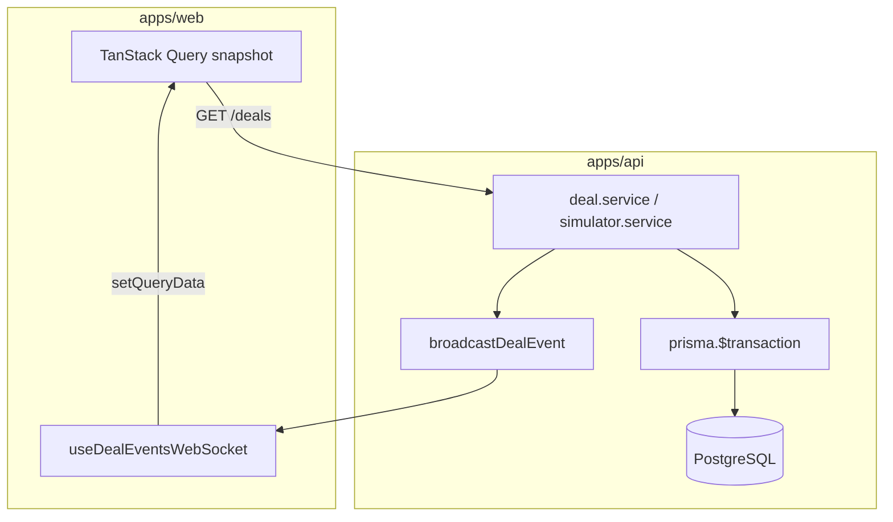

# Phase 9 — PostgreSQL persistence (local notes)

**How phase docs are structured:** **Scope** → **Walkthrough (slow)** → **Diagram** → **Key files** → **Checklist** → **Later** → **Review one-liner**.

---

## Scope (what Phase 9 was)

- **ORM:** **Prisma** (see [Why Prisma](#why-prisma-not-drizzle) below).
- **Postgres tables:** `User`, `Deal`, `AuditEvent` — enums aligned with `@otcflow/shared`.
- **Replaced:** in-memory `deal.store` / `audit.store` with **repositories** + `prisma.$transaction` on writes.
- **Unchanged:** REST contracts, WebSocket `DealEvent` + `sequenceNumber`, simulator start/stop/reset, Phase 6 `x-user-id`, Phase 7 audit semantics.
- **Seed:** `prisma/seed.ts` — users + 100 generated deals + `DEAL_CREATED` audit rows.
- **Docs:** [apps/api/DATABASE.md](../../apps/api/DATABASE.md) — local Postgres setup.
- **Not added:** Docker, GraphQL, AWS, JWT/RBAC, **optimistic locking** (version checked in SQL).

Run **`npm run db:migrate`** + **`npm run db:seed`** then **`npm run dev:api`** + **`npm run dev:web`**.

---

## Why Prisma (not Drizzle)

| Criterion | Prisma | Drizzle |
| --------- | ------ | ------- |
| Migrations in repo | `prisma migrate` + SQL history | drizzle-kit (more wiring) |
| Seed script | `prisma db seed` in `package.json` | manual |
| Team onboarding | one `schema.prisma`, generated client | TS schema + SQL mindset |

**Shared Zod** in `@otcflow/shared` stays the **API wire contract**; Prisma models **mirror** it in the database. Mappers (`toDeal`, `toAuditEvent`) convert rows ↔ JSON shapes.

---

## What problem this solves

| Before (Phase 8) | After (Phase 9) |
| ---------------- | --------------- |
| Deals/audit lost on API restart | Survive restarts |
| Single process heap | Postgres as system of record |
| `dealStore.replaceAll` | `DELETE` + `createMany` in transaction |

**Still in memory:** simulator `running` flag, `setInterval`, `eventsEmitted`, WebSocket `sequenceNumber` counter (process-local).

---

## Walkthrough (slow)

### 1. Schema (`apps/api/prisma/schema.prisma`)

- **`User`** — `id`, `name`, `role` (demo actors + Market Simulator).
- **`Deal`** — full trade row; `notional`/`price` as `Decimal`; index on `updatedAt`.
- **`AuditEvent`** — append-only; **denormalized** `userName`/`userRole` snapshot + FK to `User`; cascade delete with deal.

### 2. Repositories (data access layer)

| Module | Role |
| ------ | ---- |
| `repositories/deal.repository.ts` | `listDeals`, `findDealById`, `insertDeal`, `updateDeal`, `createMany`, `deleteAll`, `findRandomDealId` |
| `repositories/audit.repository.ts` | `insertAuditEvent`, `listAuditEventsForDealNewestFirst`, `createMany`, `deleteAll` |
| `repositories/user.repository.ts` | `seedUsersIfEmpty`, `listUsersFromDb` |
| `db/mappers.ts` | Prisma row → shared `Deal` / `AuditEvent` (ISO strings, `Number(decimal)`) |

Services no longer import stores — they call repositories + `prisma.$transaction`.

### 3. Transactional writes (deal + audit)

**Create deal** (`deal.service.createDeal`):

```text
prisma.$transaction:
  insert Deal
  insert AuditEvent (DEAL_CREATED)
→ broadcastDealEvent (after commit)
```

**Update status** — same pattern: read existing → bump `version` in app → `update Deal` + `DEAL_STATUS_CHANGED` audit, then WS.

**Simulator tick** — identical pipeline per emit; `tickInFlight` prevents overlapping async ticks on a **single** API process (not cross-process locking).

### 3a. Concurrency — what `version` does and does **not** do

**What we have:**

- Every successful write increments `Deal.version` in application code (`existing.version + 1` or `1` on create).
- Audit rows store the deal `version` at event time.
- **Clients** drop stale WebSocket snapshots: `incoming.version <= existing.version` → no change (`useDealEventsWebSocket`).

**Not in scope (call out in review):**

- **No optimistic locking in the database.** `deal.repository.updateDeal` runs a plain `UPDATE` by `id` only — not `WHERE id = ? AND version = ?`.
- **Two concurrent patches** to the same deal (two humans, or human + simulator tick) can **race**: both read version *N*, both write version *N+1*, **last writer wins** in Postgres. The loser’s change is overwritten; audit may show two events but current state reflects only the winner.
- **Production** typically adds: optimistic concurrency (`UPDATE … AND version = ?` → 409 on conflict), row-level locks, or serializable transactions for material transitions.

**Simulator-only guard:** `tickInFlight` stops one Node process from running two tick transactions at once; it does **not** stop a concurrent `PATCH` from the UI on the same deal.

### 3b. REST snapshot vs WebSocket broadcast (after DB commit)

**`broadcastDealEvent`** = **WebSocket only** (fan-out to all connected browsers). It is **not** the HTTP response.

On every successful create/status (and simulator emit):

```text
prisma.$transaction → commit
→ broadcastDealEvent (WS delta: full deal snapshot + sequenceNumber)
→ HTTP response body (REST: deal JSON to caller only)
```

**Client behaviour:**

| Who | Blotter list update |
| --- | ------------------- |
| **You** (create / status patch) | `onSuccess` → `invalidateQueries(['deals'])` → **full GET /deals** snapshot; WS also arrives (may no-op if refetch already has same version) |
| **Other tabs / simulator** | WS `setQueryData` merge only (patch one row in TanStack cache) |
| **Page load / WS reconnect / simulator reset** | **GET /deals** snapshot (reconnect invalidates — no WS replay log) |

There is **no** persisted WebSocket event log; missed messages while disconnected are recovered by **refetching the snapshot**, not replaying deltas.

### 4. API contracts unchanged

| Route | Behaviour |
| ----- | --------- |
| `GET /deals` | `findMany` ordered by `updatedAt` desc |
| `GET /deals/:id` | `findUnique` → 404 |
| `POST /deals` | transaction + WS |
| `PATCH /deals/:id/status` | version++, transaction + WS |
| `GET /deals/:id/events` | audit `findMany` newest first |

### 5. Users (still “mock”)

- Seeded from `MOCK_USERS` + `SIMULATOR_SYSTEM_USER`.
- `initUserCache()` on boot loads DB → in-memory `Map` for sync `getUserById` / `req.currentUser`.
- No login — same Phase 6 header model.

### 6. Simulator + Postgres

- **`reset`:** transaction — delete audit, delete deals, `createMany` deals, `createMany` audit seeds, bump `streamEpoch`.
- **`start`/`stop`:** unchanged (in-memory).
- **`getSimulatorStatus`:** `dealCount` from `prisma.deal.count()`.

### 7. Seed script

`npm run db:seed -w @otcflow/api`:

1. Users if empty  
2. Skip deals if any exist  
3. Else 100 `generateDeals()` + audit `DEAL_CREATED` per row  

Simulator **Reset data** can load 500–5k (separate from seed).

### 8. Boot sequence (`index.ts`)

```text
prisma.$connect()
initUserCache()
httpServer.listen()
```

Removed module-level `seedAuditCreatedEventsFromDeals(dealStore.getAll())` (was circular-import prone).

---

## Diagram — persistence vs realtime



**Linear review chain:**

```
HTTP/WS handler → service → repository → Postgres (transaction)
→ commit → broadcastDealEvent → client merge
```

---

## Key files (Phase 9)

| Path | Role |
| ---- | ---- |
| `apps/api/prisma/schema.prisma` | Tables + enums |
| `apps/api/prisma/seed.ts` | Starter book |
| `apps/api/DATABASE.md` | Local Postgres instructions |
| `apps/api/src/db/prisma.ts` | Singleton client |
| `apps/api/src/db/mappers.ts` | Row ↔ shared types |
| `apps/api/src/repositories/deal.repository.ts` | Deal CRUD |
| `apps/api/src/repositories/audit.repository.ts` | Audit append/list |
| `apps/api/src/services/deal.service.ts` | Transactional create/status + WS |
| `apps/api/src/services/simulator.service.ts` | Async ticks + DB reset |

**Three files to know cold:**

1. **`prisma/schema.prisma`** — what is persisted and how tables relate.  
2. **`services/deal.service.ts`** — transactional write pattern (deal + audit + broadcast).  
3. **`repositories/deal.repository.ts`** + **`audit.repository.ts`** — actual SQL access.

---

## How persistence changes architecture

| Layer | Phase 8 | Phase 9 |
| ----- | ------- | ------- |
| **System of record** | `dealStore` / `auditEventStore` arrays | **PostgreSQL** |
| **API process** | Owns all truth | **Cache + publisher**; truth in DB |
| **Restart** | Book empty unless simulator reset | **Seed/migrations** restore |
| **Concurrency** | Single Node process | DB ACID transactions on **single writes**; **no** cross-request optimistic locking yet (see [Concurrency](#3a-concurrency--what-version-does-and-does-not-do)) |
| **Client** | Unchanged | Still snapshot + WS deltas |

---

## What can go wrong (review)

| Failure | What happens |
| ------- | ------------ |
| **Transaction fails** (DB down, FK violation) | No deal/audit change; **no WS** (broadcast is after `await transaction`); HTTP 5xx |
| **Commit OK, broadcast fails** | DB correct; some UIs stale until **GET /deals** refetch or WS reconnect |
| **Concurrent updates, same deal** | Last writer wins; both may append audit; **current `Deal` row** = winner only; versions can collide at *N+1* (no DB version check) |
| **Human PATCH vs simulator tick, same deal** | Same race as above; `tickInFlight` does not serialize against REST |
| **WS out of order** | Client drops via `sequenceNumber` then `deal.version` |
| **Missed WS while disconnected** | No replay; reconnect → **invalidateQueries** → full snapshot |
| **Simulator reset mid-tick** | Reset stops timer first; transactional wipe reduces partial books |
| **Audit `userId` FK** | Write fails if user not seeded (boot `initUserCache`) |
| **Cascade delete on deal** | Demo reset deletes audit with deals — **not** production WORM audit |
| **Multi-instance API** | Each process has its own `sequenceNumber`; not safe for horizontal scale without shared counter/outbox |
| **Commit then crash before broadcast** | DB truth correct; clients lag until refetch |

---

## Production mapping

How Phase 9 maps to a real OTC stack (same **shape**, stronger **guarantees** in prod):

| OTCFlow (Phase 9) | Production pattern |
| ----------------- | ------------------ |
| **`Deal` table** | Ticket / trade **golden record** (OLTP) |
| **`AuditEvent` table** | Compliance / ops **event store** (who / when / what); often **immutable** (no cascade delete) |
| **Transaction: deal + audit** | Atomic business write — state change and audit fact together |
| **`broadcastDealEvent` after commit** | **Notification** layer (WS, Kafka, etc.); often **outbox** so fan-out survives process crash |
| **`GET /deals` snapshot** | Query API or read replica; pagination at scale |
| **`version` on deal** | Optimistic concurrency — usually **enforced in SQL**, not app-only |
| **In-memory simulator + WS seq** | Adapters / schedulers; **durable** sequence or event log for multi-node |
| **Prisma + Postgres** | Managed OLTP; Zod/`@otcflow/shared` = **wire contract** |

**Production adds (not in this phase):** JWT/RBAC, connection pooling, cursor pagination, idempotent commands, optimistic locking, audit WORM, read replicas, outbox for reliable WS.

**Production path:** same shape — Postgres (or replicated store), optional read replicas for `GET /deals`, event bus for WS, audit table WORM-protected.

---

## Checklist (review)

1. `apps/api/.env` with valid `DATABASE_URL`.
2. `npm run db:migrate` + `npm run db:seed`.
3. `npm run dev:api` → `PostgreSQL connected`.
4. `GET /health` OK (DB ping).
5. `GET /deals` returns seeded rows; restart API — **data still there**.
6. Create deal + change status → rows in DB + WS + audit drawer.
7. Simulator reset/start → 2k deals persist; stop/start survives API restart (book remains).

---

## Later

- **Optimistic locking** — `UPDATE Deal SET … WHERE id = ? AND version = ?`; 409 on conflict.
- Connection pooling / PgBouncer for production.
- Cursor pagination on `GET /deals`.
- Outbox pattern: WS broadcast from DB event log (avoid “committed but not broadcast”).
- Move `sequenceNumber` to DB or Redis for multi-instance API.

---

## Review one-liner

Phase 9 moves **deals** and **audit** to **PostgreSQL via Prisma**, keeps **REST/WS/simulator** contracts, uses **transactions** for deal+audit writes, and **seed + DATABASE.md** for local setup — snapshot + delta on the client unchanged. **Explicitly not done:** DB-level optimistic locking; concurrent patches can race (last writer wins).

**Builds on:** [phase-7-audit-trail.md](phase-7-audit-trail.md), [phase-8-market-simulator.md](phase-8-market-simulator.md).
